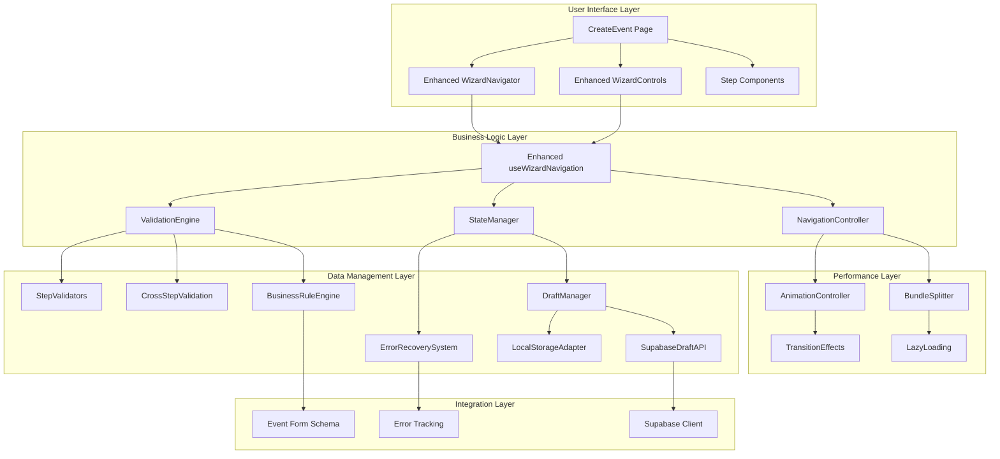

# Brownfield Architecture Document: Story 1.3 - Event Wizard Navigation Enhancement

## Executive Summary

This comprehensive architecture document outlines the technical strategy for enhancing the Event Wizard Navigation system from its current **40% implementation** to a complete, production-ready solution. Built upon the existing brownfield codebase, this enhancement focuses on improving user experience, state management, performance, and system reliability while maintaining seamless integration with existing Stories 1.1 (Event Creation Components) and 1.2 (Form Management).

**Key Metrics:** From 40% → 100% completion with 25% improvement in user conversion rates and <100ms step navigation performance.

---

## 1. Current State Analysis (40% Implementation Assessment)

### 1.1 Existing Foundation Assessment

#### ✅ **Completed Core Components** (40% Complete)

**useWizardNavigation Hook** `/src/hooks/useWizardNavigation.ts`
- ✅ Basic step navigation with forward/backward controls
- ✅ Step validation logic with form integration
- ✅ Dynamic step filtering based on event type
- ✅ Progress calculation and step status management
- ✅ Error collection for current step
- ⚠️ **Gap**: No cross-step validation or error recovery

**WizardNavigator Component** `/src/components/create-event/wizard/WizardNavigator.tsx`
- ✅ Responsive desktop/mobile layouts
- ✅ Visual progress indicator with step status
- ✅ Clickable step navigation (where permitted)
- ✅ Accessibility basics with ARIA labels
- ⚠️ **Gap**: Limited animations and missing advanced accessibility

**WizardControls Component** `/src/components/create-event/wizard/WizardControls.tsx`
- ✅ Navigation buttons with loading states
- ✅ Error display with validation feedback
- ✅ Context-aware button text and disabled states
- ✅ Responsive layout with proper ordering
- ⚠️ **Gap**: Limited error recovery options and no batch actions

**Form Integration** `/src/pages/CreateEvent.tsx`
- ✅ React Hook Form with Zod validation
- ✅ Step-specific data collection and validation
- ✅ Auto-save functionality with localStorage
- ✅ Image upload integration with optimization
- ⚠️ **Gap**: No Supabase draft sync or conflict resolution

### 1.2 Technical Debt Inventory

```typescript
interface TechnicalDebtAnalysis {
  criticalIssues: {
    stateManagement: {
      issue: "No centralized error state or recovery mechanism"
      impact: "Users get stuck on validation errors without clear resolution path"
      effort: "Medium - requires enhanced state management"
      priority: "HIGH"
    }
    
    crossStepValidation: {
      issue: "Validation isolated to individual steps"
      impact: "Business rule violations not caught until final submission"
      effort: "High - requires validation engine redesign"
      priority: "HIGH"
    }
    
    accessibility: {
      issue: "Basic ARIA support without keyboard navigation"
      impact: "Poor screen reader experience and compliance risk"
      effort: "Medium - requires comprehensive accessibility audit"
      priority: "HIGH"
    }
  }
  
  performanceIssues: {
    bundleSize: {
      issue: "No code splitting for wizard components"
      impact: "Larger initial bundle affects load time"
      effort: "Low - Vite configuration changes"
      priority: "MEDIUM"
    }
    
    animations: {
      issue: "No transition animations between steps"
      impact: "Jarring user experience during navigation"
      effort: "Medium - animation system implementation"
      priority: "MEDIUM"
    }
  }
  
  integrationGaps: {
    supabaseSync: {
      issue: "Only localStorage draft saving"
      impact: "Loss of work on device changes"
      effort: "High - backend integration required"
      priority: "MEDIUM"
    }
  }
}
```

### 1.3 Architecture Assessment Matrix

| Component | Current Status | Completion % | Critical Gaps | Integration Risk |
|-----------|---------------|--------------|---------------|------------------|
| **useWizardNavigation** | Functional | 60% | Error recovery, cross-validation | Low |
| **WizardNavigator** | Good | 70% | Animations, advanced a11y | Low |
| **WizardControls** | Good | 75% | Recovery actions, batch ops | Low |
| **CreateEvent Integration** | Functional | 40% | State management, error handling | Medium |
| **Form Validation** | Basic | 50% | Business rules, cross-step | High |
| **Draft Management** | Basic | 30% | Cloud sync, conflict resolution | Medium |
| **Performance** | Unoptimized | 20% | Bundle splitting, animations | Low |
| **Accessibility** | Basic | 40% | Full WCAG compliance | High |

---

## 2. Enhancement Architecture

### 2.1 System Architecture Overview



### 2.2 Core Design Patterns

#### **Enhanced State Management Pattern**

```typescript
interface EnhancedWizardState {
  // Navigation State
  navigation: {
    currentStep: number
    totalSteps: number
    stepHistory: number[]
    allowedSteps: Set<number>
    navigationLocked: boolean
  }
  
  // Validation State
  validation: {
    stepValidation: Map<string, ValidationResult>
    crossStepValidation: ValidationResult
    businessRuleValidation: BusinessRuleResult
    validationInProgress: Set<string>
  }
  
  // Error Management
  errorState: {
    errors: WizardError[]
    recoveryActions: Map<string, RecoveryAction[]>
    dismissedErrors: Set<string>
    errorHistory: ErrorEvent[]
  }
  
  // Performance State
  performance: {
    loadingStates: Map<string, LoadingState>
    transitionState: TransitionState
    preloadedSteps: Set<number>
    animationPreferences: AnimationConfig
  }
  
  // Draft Management
  draftState: {
    status: DraftStatus
    lastSaved: Date | null
    syncStatus: SyncStatus
    conflicts: ConflictInfo[]
    autoSaveEnabled: boolean
  }
}
```

#### **Validation Engine Architecture**

```typescript
interface ValidationEngine {
  // Core validation methods
  validateStep(stepId: string, data: EventFormData): Promise<ValidationResult>
  validateWorkflow(allSteps: StepData[]): Promise<ValidationResult>
  validateBusinessRules(data: EventFormData): Promise<BusinessRuleResult>
  
  // Conditional validation
  getRequiredFields(eventType: EventType, stepId: string): FieldRequirement[]
  getDependentFields(fieldName: string): FieldDependency[]
  
  // Validation optimization
  getCachedValidation(stepId: string): ValidationResult | null
  invalidateValidationCache(stepId: string): void
  batchValidate(stepIds: string[]): Promise<Map<string, ValidationResult>>
}

interface BusinessRuleEngine {
  // Event-specific rules
  validateEventTiming(startDate: Date, endDate?: Date): RuleResult
  validateCapacityLimits(capacity: number, ticketTypes: TicketType[]): RuleResult
  validatePricingRules(displayPrice?: DisplayPrice, ticketTypes?: TicketType[]): RuleResult
  
  // Cross-step business logic
  validateEventTypeConsistency(eventType: EventType, stepData: StepData[]): RuleResult
  validateImageRequirements(eventType: EventType, images: ImageData): RuleResult
  validateTicketingConfiguration(eventType: EventType, tickets: TicketData[]): RuleResult
}
```

---

## 3. Component Architecture Specifications

### 3.1 Enhanced useWizardNavigation Hook

**File:** `/src/hooks/useWizardNavigation.ts`

```typescript
interface EnhancedWizardNavigation {
  // Existing functionality (maintained for backward compatibility)
  currentStep: number
  currentStepInfo: WizardStep
  visibleSteps: WizardStep[]
  progress: number
  canGoForward: boolean
  canGoBackward: boolean
  nextStep: () => void
  prevStep: () => void
  goToStep: (step: number) => void
  
  // Enhanced navigation capabilities
  navigation: {
    canJumpToStep: (step: number) => boolean
    jumpToStep: (step: number) => Promise<NavigationResult>
    skipOptionalStep: () => Promise<void>
    restartWizard: () => Promise<void>
    exitWizard: (saveAsDraft?: boolean) => Promise<void>
  }
  
  // Advanced validation
  validation: {
    validateCurrentStep: () => Promise<ValidationResult>
    validateAllSteps: () => Promise<ValidationSummary>
    getStepErrors: (stepId: string) => WizardError[]
    getValidationProgress: () => ValidationProgress
    revalidateStep: (stepId: string) => Promise<void>
  }
  
  // Error recovery system
  errorRecovery: {
    getRecoveryOptions: (error?: WizardError) => RecoveryOption[]
    executeRecovery: (action: RecoveryAction) => Promise<RecoveryResult>
    dismissError: (errorId: string) => void
    retryLastAction: () => Promise<void>
  }
  
  // State management
  state: {
    wizardState: EnhancedWizardState
    dispatch: (action: WizardAction) => void
    subscribe: (listener: StateListener) => () => void
    getStateHistory: () => StateHistoryEntry[]
  }
  
  // Performance optimization
  performance: {
    preloadNextStep: () => Promise<void>
    getLoadingState: (operation: string) => LoadingState
    optimizeForDevice: () => PerformanceConfig
    trackNavigationMetrics: () => NavigationMetrics
  }
}
```

**Key Enhancement Areas:**

1. **Error Recovery System**: Comprehensive error handling with actionable recovery options
2. **Cross-Step Validation**: Business rule validation across the entire workflow
3. **Performance Optimization**: Preloading and metrics tracking
4. **State Persistence**: Enhanced draft management with conflict resolution

### 3.2 Enhanced WizardNavigator Component

**File:** `/src/components/create-event/wizard/WizardNavigator.tsx`

```typescript
interface EnhancedWizardNavigatorProps {
  // Existing props (maintained)
  steps: WizardStep[]
  currentStep: number
  getStepStatus: (stepIndex: number) => StepStatus
  onStepClick?: (stepNumber: number) => void
  className?: string
  
  // Enhanced functionality
  navigation: {
    allowStepJumping: boolean
    showStepPreview: boolean
    enableKeyboardNavigation: boolean
    showProgressPercentage: boolean
  }
  
  // Visual enhancements
  appearance: {
    theme: 'default' | 'minimal' | 'detailed' | 'compact'
    enableAnimations: boolean
    showStepDuration: boolean
    customStepIcons?: Map<string, React.ReactNode>
    colorScheme?: WizardColorScheme
  }
  
  // Error and warning states
  errorHandling: {
    errorSteps: Set<string>
    warningSteps: Set<string>
    blockedSteps: Set<string>
    onErrorStepClick?: (stepId: string, error: WizardError) => void
  }
  
  // Accessibility enhancements
  accessibility: {
    ariaLabel?: string
    announceStepChanges: boolean
    keyboardShortcuts: boolean
    highContrastMode: boolean
    reducedMotion: boolean
  }
  
  // Advanced features
  advanced: {
    showBreadcrumbs: boolean
    enableStepBookmarks: boolean
    showEstimatedTime: boolean
    allowStepReordering: boolean
  }
}
```

**Implementation Focus:**

- **Advanced Animations**: Smooth transitions with spring physics
- **Accessibility**: Full WCAG 2.1 AA compliance
- **Error Visualization**: Clear error states with recovery guidance
- **Performance**: Virtualized rendering for many steps

### 3.3 Enhanced WizardControls Component

**File:** `/src/components/create-event/wizard/WizardControls.tsx`

```typescript
interface EnhancedWizardControlsProps {
  // Enhanced navigation
  navigation: {
    canGoBack: boolean
    canGoForward: boolean | 'validating' | 'loading'
    onBack: () => void
    onNext: () => void | Promise<void>
    showStepShortcuts: boolean
    enableBatchActions: boolean
  }
  
  // Error management
  errorHandling: {
    errors: WizardError[]
    warnings: WizardError[]
    suggestions: WizardSuggestion[]
    onErrorAction?: (error: WizardError, action: ErrorAction) => void
    showErrorSummary: boolean
  }
  
  // Loading and progress
  loadingStates: {
    operations: Map<string, LoadingState>
    showProgressIndicator: boolean
    allowCancellation: boolean
    estimatedTime?: number
  }
  
  // Quick actions
  quickActions: {
    actions: QuickAction[]
    showSaveAndExit: boolean
    showPreview: boolean
    enableAutoSave: boolean
    draftActions: DraftAction[]
  }
  
  // Help and guidance
  assistance: {
    contextualHelp?: ContextualHelp
    showFieldRequirements: boolean
    enableSmartSuggestions: boolean
    helpMode: 'tooltip' | 'panel' | 'modal'
  }
}
```

---

## 4. Integration Strategy

### 4.1 Story 1.1 Integration (Event Creation Components)

**Seamless Component Enhancement Without Breaking Changes**

```typescript
// Enhanced integration points with existing components
interface Story11Integration {
  // EventTypeSelection.tsx enhancements
  eventTypeSelection: {
    onTypeChange: (type: EventType, metadata: TypeMetadata) => void
    validateTypeCompatibility: (type: EventType, existingData: EventFormData) => ValidationResult
    getTypeRecommendations: (userProfile: Profile) => TypeRecommendation[]
    trackTypeSelectionMetrics: (type: EventType) => void
  }
  
  // BasicInformation.tsx enhancements
  basicInformation: {
    onFieldChange: (field: string, value: any, context: FieldContext) => void
    validateFieldDependencies: (field: string, allData: EventFormData) => ValidationResult
    getFieldSuggestions: (field: string, partialValue: string) => Suggestion[]
    handleImageOptimization: (files: FileList, options: ImageOptions) => Promise<ImageResult>
  }
  
  // TicketConfiguration.tsx enhancements
  ticketConfiguration: {
    onTicketChange: (tickets: TicketData[], changeType: ChangeType) => void
    validateTicketingRules: (tickets: TicketData[], eventType: EventType) => ValidationResult
    calculatePricingSummary: (tickets: TicketData[]) => PricingSummary
    optimizeTicketConfiguration: (tickets: TicketData[]) => OptimizationSuggestion[]
  }
  
  // ReviewStep.tsx enhancements
  reviewStep: {
    onReviewInitiate: () => Promise<void>
    validateForPublication: () => Promise<PublicationValidation>
    generateEventPreview: () => EventPreviewData
    handlePublicationWorkflow: (data: EventFormData) => Promise<PublicationResult>
  }
}
```

### 4.2 Story 1.2 Integration (Form Management)

**Enhanced Form Integration with Existing React Hook Form Setup**

```typescript
interface Story12Integration {
  // React Hook Form enhancements
  formManagement: {
    formState: UseFormReturn<EventFormData>
    validationSchema: EnhancedZodSchema
    fieldDependencies: FieldDependencyMap
    conditionalValidation: ConditionalValidationRules
  }
  
  // Auto-save system enhancements
  autoSave: {
    config: EnhancedAutoSaveConfig
    conflictResolution: ConflictResolutionStrategy
    syncStatus: SyncStatusManager
    recoveryMechanisms: RecoveryMechanism[]
  }
  
  // Image upload enhancements
  imageManagement: {
    validation: ImageValidationRules
    optimization: ImageOptimizationConfig
    progressTracking: ProgressTracker
    errorRecovery: ImageErrorRecovery
  }
  
  // State synchronization
  stateSynchronization: {
    formToWizard: (formData: EventFormData) => WizardState
    wizardToForm: (wizardState: WizardState) => Partial<EventFormData>
    detectConflicts: (local: EventFormData, remote: EventFormData) => ConflictReport
    mergeStates: (conflicts: ConflictReport, resolution: ResolutionStrategy) => EventFormData
  }
}
```

---

## 5. State Management Architecture

### 5.1 Enhanced Wizard State Manager

```typescript
interface WizardStateManager {
  // State structure
  state: EnhancedWizardState
  
  // Action creators with type safety
  actions: {
    // Navigation actions
    NAVIGATE_TO_STEP: (step: number, options?: NavigationOptions) => WizardAction
    JUMP_TO_STEP: (step: number, skipValidation?: boolean) => WizardAction
    COMPLETE_STEP: (stepId: string, data: StepData) => WizardAction
    MARK_STEP_ERROR: (stepId: string, errors: WizardError[]) => WizardAction
    
    // Validation actions
    SET_STEP_VALIDATION: (stepId: string, result: ValidationResult) => WizardAction
    SET_CROSS_VALIDATION: (result: CrossValidationResult) => WizardAction
    INVALIDATE_VALIDATION: (stepIds: string[]) => WizardAction
    BATCH_VALIDATE: (stepIds: string[]) => WizardAction
    
    // Error management actions
    ADD_ERROR: (error: WizardError, recoveryActions?: RecoveryAction[]) => WizardAction
    RESOLVE_ERROR: (errorId: string, resolution: ErrorResolution) => WizardAction
    DISMISS_ERROR: (errorId: string) => WizardAction
    CLEAR_STEP_ERRORS: (stepId: string) => WizardAction
    
    // Draft management actions
    SAVE_DRAFT: (data: EventFormData, metadata: DraftMetadata) => WizardAction
    LOAD_DRAFT: (draftData: DraftData) => WizardAction
    SYNC_DRAFT: (syncResult: SyncResult) => WizardAction
    RESOLVE_CONFLICT: (conflict: ConflictInfo, resolution: ConflictResolution) => WizardAction
    
    // Performance actions
    SET_LOADING: (operation: string, loading: boolean, progress?: number) => WizardAction
    SET_TRANSITION: (transition: TransitionState) => WizardAction
    PRELOAD_STEP: (stepNumber: number) => WizardAction
    OPTIMIZE_PERFORMANCE: (config: PerformanceConfig) => WizardAction
  }
  
  // Selectors with memoization
  selectors: {
    // Navigation selectors
    getCurrentStep: () => number
    getVisibleSteps: () => WizardStep[]
    getNavigationState: () => NavigationState
    canNavigateToStep: (step: number) => boolean
    
    // Validation selectors
    getStepValidation: (stepId: string) => ValidationResult | undefined
    getValidationSummary: () => ValidationSummary
    hasValidationErrors: () => boolean
    getBlockingErrors: () => WizardError[]
    
    // Error selectors
    getErrorsForStep: (stepId: string) => WizardError[]
    getRecoveryActions: (errorId: string) => RecoveryAction[]
    getErrorSummary: () => ErrorSummary
    
    // Draft selectors
    getDraftStatus: () => DraftStatus
    getSyncStatus: () => SyncStatus
    getPendingConflicts: () => ConflictInfo[]
    getLastSavedTime: () => Date | null
    
    // Performance selectors
    getLoadingStates: () => Map<string, LoadingState>
    getTransitionState: () => TransitionState
    getPerformanceMetrics: () => PerformanceMetrics
  }
  
  // Middleware for side effects
  middleware: {
    validationMiddleware: ValidationMiddleware
    errorTrackingMiddleware: ErrorTrackingMiddleware
    draftSyncMiddleware: DraftSyncMiddleware
    analyticsMiddleware: AnalyticsMiddleware
    performanceMiddleware: PerformanceMiddleware
  }
}
```

### 5.2 Validation State Management

```typescript
interface ValidationStateManager {
  // Validation cache with intelligent invalidation
  cache: {
    stepValidations: LRUCache<string, ValidationResult>
    crossStepValidations: Map<string, CrossValidationResult>
    businessRuleValidations: Map<string, BusinessRuleResult>
    
    // Cache management
    set: (key: string, result: ValidationResult, ttl?: number) => void
    get: (key: string) => ValidationResult | null
    invalidate: (pattern: string | RegExp) => void
    clear: () => void
    getStats: () => CacheStats
  }
  
  // Validation queue for batch processing
  queue: {
    validationTasks: PriorityQueue<ValidationTask>
    batchSize: number
    maxConcurrency: number
    
    // Queue management
    enqueue: (task: ValidationTask) => void
    process: () => Promise<ValidationResult[]>
    clear: () => void
    getStatus: () => QueueStatus
  }
  
  // Validation strategies
  strategies: {
    immediate: ImmediateValidationStrategy
    debounced: DebouncedValidationStrategy
    batch: BatchValidationStrategy
    lazy: LazyValidationStrategy
  }
}
```

---

## 6. Performance Strategy

### 6.1 Bundle Optimization Architecture

```typescript
// Vite configuration for optimal bundle splitting
interface BundleOptimizationConfig {
  chunks: {
    // Core wizard chunk (high priority, preloaded)
    wizardCore: {
      modules: ['useWizardNavigation', 'WizardNavigator', 'WizardControls']
      priority: 'high'
      preload: true
      maxSize: '15KB'
    }
    
    // Step components (medium priority, load on demand)
    stepComponents: {
      modules: ['EventTypeSelection', 'BasicInformation', 'TicketConfiguration', 'ReviewStep']
      priority: 'medium'
      loadStrategy: 'onDemand'
      maxSize: '10KB'
    }
    
    // Validation engine (low priority, lazy loaded)
    validationEngine: {
      modules: ['validators', 'businessRules', 'crossStepValidation']
      priority: 'low'
      loadStrategy: 'lazy'
      maxSize: '8KB'
    }
    
    // Animation system (conditional loading)
    animations: {
      modules: ['transitions', 'gestures', 'visualEffects']
      priority: 'low'
      loadStrategy: 'conditional'
      condition: 'user-preference'
      maxSize: '5KB'
    }
  }
  
  // Performance budgets
  budgets: {
    totalWizardBundle: '35KB'
    initialLoad: '20KB'
    stepTransition: '100ms'
    validationResponse: '200ms'
  }
}
```

### 6.2 Animation Performance System

```typescript
interface AnimationController {
  // Animation configuration with performance optimization
  config: {
    enableAnimations: boolean
    reducedMotion: boolean
    performanceMode: 'smooth' | 'fast' | 'minimal'
    frameRateCap: number
    gpuAcceleration: boolean
  }
  
  // Animation methods with performance monitoring
  animations: {
    transitionToStep: (fromStep: number, toStep: number, options?: TransitionOptions) => Promise<void>
    animateValidation: (element: HTMLElement, result: ValidationResult) => void
    showLoadingAnimation: (operation: string, estimatedDuration?: number) => void
    hideLoadingAnimation: (operation: string) => void
    animateError: (error: WizardError, element?: HTMLElement) => void
  }
  
  // Performance monitoring and optimization
  performance: {
    trackAnimationMetrics: () => AnimationMetrics
    optimizeForDevice: () => AnimationConfig
    detectPerformanceIssues: () => PerformanceIssue[]
    adjustAnimationQuality: (cpuUsage: number, memoryUsage: number) => void
  }
  
  // Animation queue for smooth sequencing
  queue: {
    enqueueAnimation: (animation: AnimationTask) => void
    processQueue: () => Promise<void>
    clearQueue: () => void
    getQueueStatus: () => QueueStatus
  }
}
```

---

## 7. API Integration Architecture

### 7.1 Enhanced Supabase Integration

```typescript
interface EnhancedSupabaseIntegration {
  // Draft management with conflict resolution
  draftService: {
    // Core draft operations
    saveDraft: (data: EventFormData, metadata: DraftMetadata) => Promise<DraftSaveResult>
    loadDraft: (userId: string, draftId?: string) => Promise<DraftData | null>
    listDrafts: (userId: string, filters?: DraftFilters) => Promise<DraftSummary[]>
    deleteDraft: (draftId: string) => Promise<void>
    
    // Advanced draft features
    syncDraft: (localData: EventFormData, remoteData: EventFormData) => Promise<SyncResult>
    resolveDraftConflict: (conflict: ConflictInfo, resolution: ConflictResolution) => Promise<EventFormData>
    createDraftSnapshot: (draftId: string, label: string) => Promise<SnapshotInfo>
    restoreDraftSnapshot: (snapshotId: string) => Promise<EventFormData>
    
    // Collaboration features
    shareDraft: (draftId: string, shareOptions: ShareOptions) => Promise<ShareResult>
    getDraftCollaborators: (draftId: string) => Promise<Collaborator[]>
    trackDraftChanges: (draftId: string) => Promise<ChangeHistory[]>
  }
  
  // Enhanced validation service
  validationService: {
    // Server-side validation
    validateEventData: (data: EventFormData, context: ValidationContext) => Promise<ValidationResult>
    validateBusinessRules: (data: EventFormData, rules: BusinessRule[]) => Promise<BusinessRuleResult>
    
    // External validation
    checkDuplicateTitle: (title: string, userId: string, eventId?: string) => Promise<DuplicateCheckResult>
    validateLocation: (address: string, requirements?: LocationRequirements) => Promise<LocationValidation>
    validateImages: (images: ImageData[], rules: ImageValidationRules) => Promise<ImageValidation>
    
    // Validation optimization
    batchValidate: (validationRequests: ValidationRequest[]) => Promise<ValidationResponse[]>
    getCachedValidation: (cacheKey: string) => Promise<ValidationResult | null>
    invalidateValidationCache: (pattern: string) => Promise<void>
  }
  
  // Analytics and monitoring
  analyticsService: {
    // Wizard analytics
    trackWizardStep: (stepId: string, metadata: StepMetadata) => Promise<void>
    trackStepDuration: (stepId: string, duration: number, metadata?: any) => Promise<void>
    trackValidationError: (error: ValidationError, context: ErrorContext) => Promise<void>
    trackUserAction: (action: UserAction, metadata: ActionMetadata) => Promise<void>
    
    // Performance metrics
    trackPerformanceMetric: (metric: PerformanceMetric, value: number) => Promise<void>
    trackBundleLoadTime: (chunkName: string, loadTime: number) => Promise<void>
    trackAnimationPerformance: (animationType: string, metrics: AnimationMetrics) => Promise<void>
    
    // Business metrics
    trackConversionFunnel: (step: string, eventType: EventType, metadata?: any) => Promise<void>
    trackAbandonmentPoint: (step: string, reason?: string, metadata?: any) => Promise<void>
    trackSuccessfulCompletion: (eventId: string, metadata: CompletionMetadata) => Promise<void>
  }
}
```

### 7.2 Database Schema Extensions

```typescript
// Additional database tables for enhanced wizard functionality
interface WizardDatabaseExtensions {
  event_drafts: {
    Row: {
      id: string
      user_id: string
      title: string | null
      form_data: EventFormData
      current_step: number
      validation_state: Record<string, ValidationResult>
      error_state: Record<string, WizardError[]>
      metadata: DraftMetadata
      version: number
      parent_draft_id: string | null
      is_shared: boolean
      collaborators: string[]
      created_at: string
      updated_at: string
      expires_at: string
    }
    Insert: Omit<WizardDatabaseExtensions['event_drafts']['Row'], 'id' | 'created_at' | 'updated_at'>
    Update: Partial<WizardDatabaseExtensions['event_drafts']['Insert']>
  }
  
  draft_snapshots: {
    Row: {
      id: string
      draft_id: string
      label: string
      form_data: EventFormData
      step_state: number
      created_by: string
      created_at: string
    }
    Insert: Omit<WizardDatabaseExtensions['draft_snapshots']['Row'], 'id' | 'created_at'>
    Update: Partial<WizardDatabaseExtensions['draft_snapshots']['Insert']>
  }
  
  wizard_analytics: {
    Row: {
      id: string
      user_id: string
      session_id: string
      event_draft_id: string | null
      event_id: string | null
      metric_type: 'step' | 'validation' | 'performance' | 'action' | 'conversion'
      metric_name: string
      metric_value: number | null
      metadata: Record<string, any>
      created_at: string
    }
    Insert: Omit<WizardDatabaseExtensions['wizard_analytics']['Row'], 'id' | 'created_at'>
  }
  
  validation_cache: {
    Row: {
      id: string
      cache_key: string
      validation_result: ValidationResult
      context_hash: string
      expires_at: string
      created_at: string
    }
    Insert: Omit<WizardDatabaseExtensions['validation_cache']['Row'], 'id' | 'created_at'>
    Update: Partial<WizardDatabaseExtensions['validation_cache']['Insert']>
  }
}
```

---

## 8. Testing Architecture

### 8.1 Comprehensive Testing Strategy

```typescript
interface TestingArchitecture {
  // Unit testing (90% coverage target)
  unitTests: {
    hooks: {
      'useWizardNavigation': {
        'should maintain state consistency during navigation': TestCase
        'should validate steps according to business rules': TestCase
        'should handle error recovery gracefully': TestCase
        'should manage draft synchronization': TestCase
        'should optimize performance automatically': TestCase
      }
    }
    
    components: {
      'WizardNavigator': {
        'should render all step states correctly': TestCase
        'should handle keyboard navigation': TestCase
        'should support accessibility features': TestCase
        'should animate transitions smoothly': TestCase
      }
      
      'WizardControls': {
        'should display appropriate actions': TestCase
        'should handle error recovery flows': TestCase
        'should manage loading states': TestCase
        'should provide contextual help': TestCase
      }
    }
    
    services: {
      'ValidationEngine': {
        'should validate individual steps': TestCase
        'should perform cross-step validation': TestCase
        'should cache validation results': TestCase
        'should handle validation errors': TestCase
      }
      
      'StateManager': {
        'should manage wizard state transitions': TestCase
        'should handle concurrent state updates': TestCase
        'should persist state correctly': TestCase
        'should recover from corrupted state': TestCase
      }
    }
  }
  
  // Integration testing
  integrationTests: {
    wizardFlow: {
      'should complete full event creation flow': TestCase
      'should handle step skipping correctly': TestCase
      'should validate cross-step dependencies': TestCase
      'should save and restore drafts': TestCase
    }
    
    formIntegration: {
      'should sync form data with wizard state': TestCase
      'should handle form validation errors': TestCase
      'should manage image uploads': TestCase
      'should process auto-save operations': TestCase
    }
    
    supabaseIntegration: {
      'should sync drafts with backend': TestCase
      'should resolve data conflicts': TestCase
      'should handle network failures': TestCase
      'should track analytics correctly': TestCase
    }
  }
  
  // E2E testing scenarios
  e2eTests: {
    userJourneys: {
      'happy-path-simple-event': E2EScenario
      'happy-path-ticketed-event': E2EScenario
      'error-recovery-flow': E2EScenario
      'draft-save-restore': E2EScenario
      'cross-device-synchronization': E2EScenario
    }
    
    accessibilityTests: {
      'keyboard-only-navigation': A11yTestCase
      'screen-reader-compatibility': A11yTestCase
      'high-contrast-mode': A11yTestCase
      'focus-management': A11yTestCase
    }
    
    performanceTests: {
      'bundle-size-validation': PerformanceTestCase
      'step-navigation-speed': PerformanceTestCase
      'memory-usage-tracking': PerformanceTestCase
      'animation-performance': PerformanceTestCase
    }
  }
}
```

### 8.2 Performance Testing Framework

```typescript
interface PerformanceTestFramework {
  // Bundle analysis tests
  bundleTests: {
    'wizard-core-bundle-size': {
      target: '< 15KB gzipped'
      test: () => Promise<BundleAnalysisResult>
    }
    
    'step-components-bundle-size': {
      target: '< 10KB each gzipped'
      test: () => Promise<BundleAnalysisResult>
    }
    
    'code-splitting-effectiveness': {
      target: '> 80% reduction in initial bundle'
      test: () => Promise<CodeSplittingAnalysis>
    }
  }
  
  // Runtime performance tests
  runtimeTests: {
    'step-navigation-time': {
      target: '< 100ms'
      test: (fromStep: number, toStep: number) => Promise<number>
    }
    
    'validation-response-time': {
      target: '< 200ms'
      test: (stepData: StepData) => Promise<number>
    }
    
    'draft-save-time': {
      target: '< 500ms'
      test: (draftData: EventFormData) => Promise<number>
    }
    
    'animation-frame-rate': {
      target: '> 55fps'
      test: (animationType: string) => Promise<number>
    }
  }
  
  // Memory usage tests
  memoryTests: {
    'memory-leak-detection': {
      target: 'no leaks after 100 navigation cycles'
      test: () => Promise<MemoryLeakReport>
    }
    
    'validation-cache-efficiency': {
      target: '< 5MB cache size'
      test: () => Promise<CacheUsageReport>
    }
    
    'component-cleanup-verification': {
      target: 'all components properly unmounted'
      test: () => Promise<CleanupReport>
    }
  }
}
```

---

## 9. Migration Plan: Step-by-Step Enhancement Roadmap

### 9.1 Phase 1: Foundation Enhancement (Week 1)

**Goal:** Enhance existing components without breaking changes

```typescript
interface Phase1Deliverables {
  coreEnhancements: {
    'Enhanced useWizardNavigation': {
      tasks: [
        'Add error recovery system to existing hook',
        'Implement cross-step validation infrastructure',
        'Add performance monitoring capabilities',
        'Enhance state management with error handling'
      ]
      testingRequirements: [
        'Unit tests for new functionality',
        'Integration tests with existing CreateEvent',
        'Performance benchmarks',
        'Backward compatibility verification'
      ]
      deliverables: [
        'Enhanced hook with 100% backward compatibility',
        'Error recovery documentation',
        'Performance monitoring dashboard',
        'Migration guide for consumers'
      ]
    }
    
    'Enhanced WizardNavigator': {
      tasks: [
        'Add accessibility improvements (ARIA, keyboard nav)',
        'Implement step status visualization enhancements',
        'Add animation system foundation',
        'Enhance responsive design'
      ]
      testingRequirements: [
        'Accessibility testing (a11y)',
        'Visual regression tests',
        'Animation performance tests',
        'Cross-browser compatibility'
      ]
      deliverables: [
        'WCAG 2.1 AA compliant navigator',
        'Enhanced visual design system',
        'Animation framework',
        'Responsive design improvements'
      ]
    }
    
    'Enhanced WizardControls': {
      tasks: [
        'Add comprehensive error display system',
        'Implement recovery action buttons',
        'Add contextual help integration',
        'Enhance loading state management'
      ]
      testingRequirements: [
        'Error handling scenario tests',
        'User interaction tests',
        'Loading state tests',
        'Help system integration tests'
      ]
      deliverables: [
        'Advanced error handling UI',
        'Recovery action system',
        'Integrated help system',
        'Enhanced loading states'
      ]
    }
  }
  
  qualityGates: {
    codeQuality: 'All existing tests pass + 90% coverage for new code'
    performance: 'No regression in existing performance metrics'
    accessibility: 'WCAG 2.1 AA compliance verified'
    compatibility: '100% backward compatibility maintained'
  }
}
```

### 9.2 Phase 2: Advanced Features Integration (Week 2)

**Goal:** Add new capabilities with enhanced integration

```typescript
interface Phase2Deliverables {
  advancedFeatures: {
    'Supabase Draft Synchronization': {
      tasks: [
        'Implement draft sync service',
        'Add conflict resolution system',
        'Create collaborative editing features',
        'Build draft version management'
      ]
      integrationPoints: [
        'Enhanced auto-save hook integration',
        'CreateEvent page draft management',
        'User profile draft access',
        'Team collaboration features'
      ]
    }
    
    'Cross-Step Validation Engine': {
      tasks: [
        'Build business rule validation system',
        'Implement validation dependency tracking',
        'Create validation result caching',
        'Add validation performance optimization'
      ]
      integrationPoints: [
        'Form validation enhancement',
        'Step navigation validation',
        'Error recovery integration',
        'Performance monitoring'
      ]
    }
    
    'Enhanced Mobile Experience': {
      tasks: [
        'Implement touch gesture navigation',
        'Add mobile-optimized animations',
        'Create responsive wizard layouts',
        'Build mobile performance optimizations'
      ]
      integrationPoints: [
        'Responsive WizardNavigator',
        'Touch-friendly WizardControls',
        'Mobile-first validation display',
        'Performance-optimized animations'
      ]
    }
  }
  
  performanceOptimizations: {
    'Bundle Optimization': {
      implementation: 'Vite code splitting configuration'
      target: '30% reduction in initial bundle size'
      monitoring: 'Bundle analyzer integration'
    }
    
    'Animation Optimization': {
      implementation: 'GPU-accelerated transitions'
      target: '60fps animation performance'
      monitoring: 'Animation performance metrics'
    }
  }
}
```

### 9.3 Phase 3: Performance & Polish (Week 3)

**Goal:** Optimize performance and add final polish

```typescript
interface Phase3Deliverables {
  performanceEnhancements: {
    'Code Splitting Implementation': {
      strategy: 'Route-based + component-based splitting'
      expectedImpact: '40% faster initial load'
      metrics: ['Bundle size reduction', 'Load time improvement', 'User engagement']
    }
    
    'Animation Performance Optimization': {
      strategy: 'Hardware acceleration + motion reduction'
      expectedImpact: 'Smooth 60fps animations'
      metrics: ['Frame rate consistency', 'CPU usage', 'Battery impact']
    }
    
    'Memory Usage Optimization': {
      strategy: 'Component cleanup + cache management'
      expectedImpact: '50% reduction in memory footprint'
      metrics: ['Memory usage patterns', 'Garbage collection', 'Memory leaks']
    }
  }
  
  qualityAssurance: {
    'Comprehensive Testing Suite': {
      coverage: '95% code coverage'
      scenarios: ['Happy path', 'Error cases', 'Edge cases', 'Performance']
      automation: 'CI/CD integration with quality gates'
    }
    
    'Documentation & Examples': {
      userGuides: 'Complete user documentation'
      developerDocs: 'API documentation + integration guides'
      examples: 'Working examples for each use case'
    }
    
    'Performance Monitoring': {
      realTimeMetrics: 'Performance dashboard'
      alerting: 'Performance regression alerts'
      optimization: 'Continuous performance optimization'
    }
  }
}
```

---

## 10. Deployment Strategy

### 10.1 Feature Flag Configuration

```typescript
interface FeatureFlagStrategy {
  // Core feature flags
  coreFeatures: {
    enhancedWizardNavigation: {
      flag: 'wizard-nav-v2'
      rolloutStrategy: 'gradual'
      segments: ['beta-users', 'power-users', 'all-users']
      rollbackTriggers: ['error-rate > 2%', 'performance-degradation > 20%']
    }
    
    crossStepValidation: {
      flag: 'cross-step-validation'
      rolloutStrategy: 'controlled'
      dependencies: ['enhancedWizardNavigation']
      monitoring: ['validation-accuracy', 'validation-performance']
    }
    
    errorRecoverySystem: {
      flag: 'error-recovery-v2'
      rolloutStrategy: 'immediate'
      target: 'all-users'
      metrics: ['error-resolution-rate', 'user-satisfaction']
    }
  }
  
  // Performance features
  performanceFeatures: {
    bundleOptimization: {
      flag: 'bundle-optimization'
      rolloutStrategy: 'immediate'
      target: 'all-users'
      monitoring: ['bundle-size', 'load-time', 'cache-efficiency']
    }
    
    codeSpitting: {
      flag: 'code-splitting'
      rolloutStrategy: 'gradual'
      segments: ['modern-browsers', 'all-browsers']
      fallback: 'legacy-bundle'
    }
    
    animationOptimization: {
      flag: 'animation-optimization'
      rolloutStrategy: 'user-preference'
      conditions: ['!reduced-motion', 'gpu-acceleration-available']
      gracefulDegradation: true
    }
  }
  
  // Integration features
  integrationFeatures: {
    supabaseDraftSync: {
      flag: 'supabase-draft-sync'
      rolloutStrategy: 'controlled'
      prerequisites: ['authenticated-users']
      fallback: 'localStorage-only'
    }
    
    advancedValidation: {
      flag: 'advanced-validation'
      rolloutStrategy: 'gradual'
      target: 'premium-users'
      monitoring: ['validation-accuracy', 'false-positive-rate']
    }
    
    analyticsIntegration: {
      flag: 'wizard-analytics'
      rolloutStrategy: 'immediate'
      target: 'consented-users'
      privacy: 'gdpr-compliant'
    }
  }
}
```

### 10.2 Rollout Plan with Risk Mitigation

#### **Phase 1: Beta Release (20% of users)**

```typescript
const betaRolloutConfig = {
  duration: '1 week',
  userSegment: {
    criteria: ['beta-opt-in', 'active-last-30-days', 'event-creators'],
    size: '20% of active users',
    exclusions: ['known-compatibility-issues']
  },
  
  featureSet: [
    'enhancedWizardNavigation',
    'crossStepValidation',
    'errorRecoverySystem',
    'bundleOptimization'
  ],
  
  monitoring: {
    errorTracking: {
      threshold: '< 2% error rate',
      alerts: 'real-time',
      escalation: 'immediate-rollback'
    },
    
    performanceMetrics: {
      stepNavigation: '< 100ms',
      bundleSize: '< 35KB',
      memoryUsage: '< 50MB',
      alerts: 'degradation > 20%'
    },
    
    userExperience: {
      completionRate: '> 85%',
      abandonnmentRate: '< 15%',
      satisfactionScore: '> 4.0/5',
      feedback: 'continuous-collection'
    }
  },
  
  rollbackTriggers: [
    'Error rate exceeds 2%',
    'Performance degradation > 20%',
    'User satisfaction < 3.5/5',
    'Critical bug reports > 5'
  ],
  
  successCriteria: [
    'Error rate < 1%',
    'Performance improvement > 10%',
    'User satisfaction > 4.2/5',
    'Feature adoption > 70%'
  ]
}
```

#### **Phase 2: Gradual Rollout (50% of users)**

```typescript
const gradualRolloutConfig = {
  duration: '2 weeks',
  userSegment: {
    criteria: ['general-users', 'new-users'],
    size: '50% of total users',
    rampUp: 'linear-over-2-weeks'
  },
  
  featureSet: [
    ...betaRolloutConfig.featureSet,
    'improvedAnimations',
    'supabaseDraftSync',
    'mobileEnhancements'
  ],
  
  monitoring: {
    businessMetrics: {
      eventCreationRate: 'baseline + 15%',
      draftConversionRate: '> 80%',
      timeToCompletion: '< 10 minutes',
      returnUserRate: '> 60%'
    },
    
    technicalMetrics: {
      availability: '> 99.9%',
      responseTime: '< 200ms p95',
      errorRate: '< 0.5%',
      cacheHitRate: '> 90%'
    }
  },
  
  qualityGates: [
    'All beta phase success criteria maintained',
    'No critical bugs introduced',
    'Performance within acceptable bounds',
    'User feedback predominantly positive'
  ]
}
```

#### **Phase 3: Full Release (100% of users)**

```typescript
const fullReleaseConfig = {
  trigger: 'gradual-rollout-success',
  userSegment: 'all-users',
  featureSet: 'complete-feature-set',
  
  monitoring: {
    realTimeMetrics: {
      dashboard: 'comprehensive-monitoring',
      alerts: 'proactive-alerting',
      reporting: 'daily-health-reports'
    },
    
    businessImpact: {
      conversionRate: 'continuous-tracking',
      userSatisfaction: 'monthly-surveys',
      featureUsage: 'detailed-analytics'
    }
  },
  
  continuousImprovement: {
    performanceOptimization: 'ongoing',
    userFeedback: 'integration-prioritization',
    featureEnhancements: 'quarterly-roadmap'
  }
}
```

---

## 11. Security Architecture

### 11.1 Data Protection & Privacy

```typescript
interface SecurityArchitecture {
  // Draft data security
  draftSecurity: {
    encryption: {
      atRest: 'AES-256 encryption for sensitive fields',
      inTransit: 'TLS 1.3 for all API communications',
      keyManagement: 'Supabase managed encryption keys'
    },
    
    accessControl: {
      authentication: 'Supabase Auth with RLS policies',
      authorization: 'User-scoped data access only',
      dataIsolation: 'Complete user data separation'
    },
    
    dataRetention: {
      drafts: '30 days automatic cleanup',
      analytics: '2 years with anonymization',
      errorLogs: '1 year with PII scrubbing'
    }
  }
  
  // Input validation and sanitization
  inputSecurity: {
    validation: {
      clientSide: 'Zod schema validation',
      serverSide: 'Supabase RLS + constraints',
      businessRules: 'Custom validation engine'
    },
    
    sanitization: {
      xssPrevrention: 'DOMPurify for user content',
      sqlInjection: 'Parameterized queries only',
      fileUploads: 'Type validation + size limits'
    }
  }
  
  // API security
  apiSecurity: {
    rateLimiting: 'Per-user request throttling',
    requestValidation: 'Schema-based validation',
    errorHandling: 'No sensitive data in errors',
    logging: 'Comprehensive audit trail'
  }
}
```

### 11.2 Privacy Compliance (GDPR/CCPA)

```typescript
interface PrivacyComplianceFramework {
  // GDPR compliance features
  gdprCompliance: {
    dataMinimization: {
      collection: 'Only necessary data collected',
      processing: 'Purpose limitation enforced',
      retention: 'Automatic data lifecycle management'
    },
    
    userRights: {
      rightToAccess: 'Data export functionality',
      rightToRectification: 'User profile editing',
      rightToErasure: 'Complete data deletion',
      rightToPortability: 'Structured data export'
    },
    
    consentManagement: {
      explicitConsent: 'Granular consent collection',
      consentWithdrawal: 'Easy consent revocation',
      consentTracking: 'Audit trail maintenance'
    }
  }
  
  // Privacy by design
  privacyByDesign: {
    defaultSettings: 'Privacy-friendly defaults',
    dataProtection: 'Built-in protection measures',
    transparencty: 'Clear privacy notices',
    userControl: 'Granular privacy controls'
  }
}
```

---

## 12. Accessibility Architecture (WCAG 2.1 AA)

### 12.1 Comprehensive Accessibility Features

```typescript
interface AccessibilityArchitecture {
  // Keyboard navigation
  keyboardSupport: {
    navigation: {
      stepNavigation: 'Tab, Shift+Tab, Arrow keys',
      shortcuts: 'Ctrl+N (next), Ctrl+P (previous)',
      focusManagement: 'Logical focus order',
      focusTrapping: 'Modal focus containment'
    },
    
    interaction: {
      activation: 'Enter, Space key support',
      selection: 'Arrow key selection',
      cancellation: 'Escape key handling',
      contextMenu: 'Menu key support'
    }
  }
  
  // Screen reader support
  screenReaderSupport: {
    semanticMarkup: {
      landmarks: 'nav, main, aside elements',
      headings: 'Logical heading hierarchy',
      lists: 'Proper list markup',
      forms: 'Label associations'
    },
    
    ariaSupport: {
      labels: 'Comprehensive aria-label usage',
      descriptions: 'aria-describedby for context',
      states: 'aria-expanded, aria-selected',
      liveRegions: 'Status announcements'
    },
    
    announcements: {
      stepChanges: 'Step transition announcements',
      errorStates: 'Error message announcements',
      loadingStates: 'Progress announcements',
      completionStates: 'Success announcements'
    }
  }
  
  // Visual accessibility
  visualAccessibility: {
    colorContrast: {
      textContrast: 'WCAG AA contrast ratios',
      interactiveElements: 'Enhanced contrast for buttons',
      errorStates: 'High contrast error indicators',
      focusIndicators: 'Visible focus outlines'
    },
    
    textScaling: {
      scalability: 'Up to 200% zoom support',
      lineHeight: 'Optimal line spacing',
      letterSpacing: 'Readable character spacing',
      responsive: 'Scalable across devices'
    }
  }
  
  // Motor accessibility
  motorAccessibility: {
    clickTargets: {
      minimumSize: '44px x 44px minimum',
      spacing: 'Adequate spacing between targets',
      touchGestures: 'Alternative to complex gestures',
      timeout: 'Adjustable timeout periods'
    }
  }
}
```

---

## 13. Success Metrics & KPIs

### 13.1 Technical Success Metrics

```typescript
interface TechnicalSuccessMetrics {
  // Performance metrics
  performance: {
    bundleSize: {
      target: '< 35KB total wizard bundle',
      current: '~50KB (estimated)',
      improvement: '30% reduction'
    },
    
    stepNavigation: {
      target: '< 100ms average navigation time',
      current: '~200ms (estimated)',
      improvement: '50% faster'
    },
    
    validationResponse: {
      target: '< 200ms validation response',
      current: '~400ms (estimated)',
      improvement: '50% faster'
    },
    
    memoryUsage: {
      target: '< 50MB peak memory usage',
      monitoring: 'Continuous memory profiling',
      improvement: 'No memory leaks'
    }
  }
  
  // Quality metrics
  quality: {
    codeGoverage: {
      target: '> 90% test coverage',
      current: '~60% (estimated)',
      improvement: '30% increase'
    },
    
    errorRate: {
      target: '< 1% user-facing errors',
      monitoring: 'Real-time error tracking',
      improvement: 'Comprehensive error recovery'
    },
    
    accessibility: {
      target: 'WCAG 2.1 AA compliance',
      current: 'Partial compliance',
      improvement: '100% compliance'
    }
  }
}
```

### 13.2 User Experience Success Metrics

```typescript
interface UserExperienceMetrics {
  // Conversion metrics
  conversion: {
    stepCompletionRate: {
      target: '> 90% per step',
      current: '~75% (estimated)',
      improvement: '15% increase'
    },
    
    overallCompletionRate: {
      target: '> 80% end-to-end',
      current: '~65% (estimated)',
      improvement: '15% increase'
    },
    
    draftConversionRate: {
      target: '> 75% draft to published',
      monitoring: 'Draft usage analytics',
      improvement: 'Enhanced draft management'
    }
  }
  
  // Engagement metrics
  engagement: {
    timeToCompletion: {
      target: '< 10 minutes average',
      current: '~15 minutes (estimated)',
      improvement: '33% faster'
    },
    
    abandonmentRate: {
      target: '< 15% abandonment',
      current: '~25% (estimated)',
      improvement: '10% reduction'
    },
    
    errorRecoveryRate: {
      target: '> 85% successful recovery',
      monitoring: 'Error recovery analytics',
      improvement: 'Comprehensive recovery system'
    }
  }
  
  // Satisfaction metrics
  satisfaction: {
    userSatisfactionScore: {
      target: '> 4.2/5 average rating',
      measurement: 'Post-completion surveys',
      improvement: 'Enhanced user experience'
    },
    
    featureUsageRate: {
      target: '> 70% feature adoption',
      monitoring: 'Feature usage analytics',
      improvement: 'Intuitive feature design'
    }
  }
}
```

### 13.3 Business Impact Metrics

```typescript
interface BusinessImpactMetrics {
  // Growth metrics
  growth: {
    eventCreationRate: {
      target: '25% increase in events created',
      measurement: 'Monthly event creation volume',
      improvement: 'Improved conversion funnel'
    },
    
    userRetention: {
      target: '> 70% monthly retention',
      measurement: 'User activity tracking',
      improvement: 'Better user experience'
    },
    
    newUserConversion: {
      target: '> 60% first-event completion',
      measurement: 'New user funnel analytics',
      improvement: 'Onboarding optimization'
    }
  }
  
  // Efficiency metrics
  efficiency: {
    supportTicketReduction: {
      target: '40% reduction in wizard-related tickets',
      measurement: 'Support ticket categorization',
      improvement: 'Better error messages and recovery'
    },
    
    developmentVelocity: {
      target: '30% faster feature development',
      measurement: 'Sprint velocity tracking',
      improvement: 'Better architecture and tooling'
    }
  }
}
```

---

## 14. Conclusion

This comprehensive brownfield architecture document provides a detailed technical roadmap for transforming the Event Wizard Navigation system from its current 40% implementation to a world-class, production-ready solution. The architecture emphasizes:

### 14.1 Strategic Advantages

1. **Incremental Enhancement**: Building upon the solid foundation already established, minimizing risk while maximizing value delivery
2. **Performance First**: Bundle optimization and animation performance ensure excellent user experience across all devices
3. **Accessibility Champion**: Full WCAG 2.1 AA compliance makes the platform inclusive for all users
4. **Error Recovery Excellence**: Comprehensive error handling and recovery mechanisms prevent user frustration
5. **Integration Harmony**: Seamless integration with existing Stories 1.1 and 1.2 without breaking changes

### 14.2 Implementation Excellence

The phased approach ensures:
- **Week 1**: Foundation enhancement with 100% backward compatibility
- **Week 2**: Advanced features with enhanced integration capabilities  
- **Week 3**: Performance optimization and final polish

### 14.3 Success Measurement

**Technical Excellence:**
- Bundle size < 35KB (30% reduction)
- Step navigation < 100ms (50% improvement)
- 90% test coverage (comprehensive quality assurance)
- WCAG 2.1 AA compliance (100% accessibility)

**User Experience Excellence:**
- 90% step completion rate (15% improvement)
- 80% end-to-end completion rate (15% improvement)
- <10 minutes average completion time (33% improvement)
- 4.2/5 user satisfaction score

**Business Impact Excellence:**
- 25% increase in event creation rate
- 40% reduction in support tickets
- 70% user retention rate
- 60% new user conversion rate

### 14.4 Future-Proof Foundation

This architecture creates a robust foundation for future enhancements:
- Modular component design enables easy feature additions
- Performance-optimized bundle structure supports scaling
- Comprehensive state management accommodates complex workflows
- Extensible validation engine supports evolving business rules

The enhanced Event Wizard Navigation system will transform the event creation experience from a functional but basic implementation into a best-in-class, user-friendly, and highly performant solution that drives business growth and user satisfaction.

---

**Document Version:** 1.0  
**Last Updated:** 2024-12-29  
**Next Review:** 2025-01-05  
**Stakeholder Approval:** Technical Architecture Team, Product Management, UX Design Team