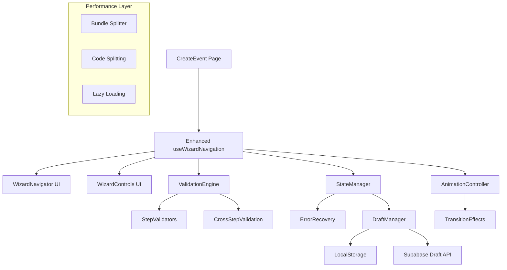

# Architecture Document: Story 1.3 - Event Wizard Navigation Enhancement

## Executive Summary

This document outlines the technical architecture for enhancing the Event Wizard Navigation system from its current 40% implementation to a complete, production-ready solution. The enhancement focuses on improving user experience, state management, and system reliability while maintaining integration with existing Stories 1.1 and 1.2 implementations.

## Current Architecture Assessment

### Existing Implementation Analysis (40% Complete)

#### ✅ Completed Components
- **useWizardNavigation Hook**: Core navigation logic with step validation
- **WizardNavigator Component**: Visual progress indicator with desktop/mobile responsive design
- **WizardControls Component**: Navigation buttons with error handling
- **Form Integration**: React Hook Form + Zod validation integration
- **Auto-save Functionality**: Draft persistence with localStorage
- **Basic Step Validation**: Field-level validation for navigation control

#### ⚠️ Partially Implemented
- **State Management**: Basic state handling without error recovery
- **Navigation Guards**: Simple validation without complex business rules
- **Mobile Experience**: Basic responsive design without touch gestures
- **Performance**: No bundle optimization or code splitting

#### ❌ Missing Critical Features
- **Advanced Validation Logic**: Cross-step validation and conditional requirements
- **Error Recovery**: Robust error handling and recovery mechanisms
- **Animation System**: Smooth step transitions and visual feedback
- **Accessibility**: ARIA support and keyboard navigation
- **Supabase Integration**: Draft saving to database vs localStorage only
- **Bundle Optimization**: Code splitting and performance optimizations

### Technical Debt Assessment

```typescript
// Current Issues Identified:
interface TechnicalDebt {
  stateManagement: {
    issue: "No centralized error state management"
    impact: "Inconsistent error handling across steps"
    priority: "HIGH"
  }
  
  validation: {
    issue: "Validation logic scattered across components"
    impact: "Difficult to maintain business rules"
    priority: "MEDIUM"
  }
  
  performance: {
    issue: "No code splitting for wizard components"
    impact: "Larger initial bundle size"
    priority: "LOW"
  }
  
  accessibility: {
    issue: "Missing ARIA labels and keyboard navigation"
    impact: "Poor screen reader experience"
    priority: "HIGH"
  }
}
```

## Enhancement Architecture

### System Overview



### Core Architecture Patterns

#### 1. Enhanced State Management Pattern

```typescript
interface EnhancedWizardState {
  // Navigation State
  currentStep: number
  totalSteps: number
  stepHistory: number[]
  
  // Validation State  
  stepValidation: Record<string, ValidationResult>
  crossStepValidation: ValidationResult
  
  // Error State
  errors: WizardError[]
  recoveryActions: RecoveryAction[]
  
  // Performance State
  loadingStates: Record<string, boolean>
  transitionState: TransitionState
  
  // Draft State
  draftStatus: DraftStatus
  lastSaved: Date | null
  syncStatus: SyncStatus
}
```

#### 2. Validation Engine Architecture

```typescript
interface ValidationEngine {
  // Step-level validation
  validateStep(stepId: string, data: EventFormData): Promise<ValidationResult>
  
  // Cross-step validation
  validateWorkflow(allSteps: StepData[]): Promise<ValidationResult>
  
  // Conditional validation based on event type
  getRequiredFields(eventType: EventType, stepId: string): string[]
  
  // Business rule validation
  validateBusinessRules(data: EventFormData): Promise<ValidationResult>
}
```

#### 3. Error Recovery System

```typescript
interface ErrorRecoverySystem {
  // Error classification
  classifyError(error: Error): ErrorType
  
  // Recovery strategies
  getRecoveryActions(error: WizardError): RecoveryAction[]
  
  // Auto-recovery attempts
  attemptAutoRecovery(error: WizardError): Promise<RecoveryResult>
  
  // User-guided recovery
  showRecoveryOptions(error: WizardError): RecoveryOption[]
}
```

## Component Architecture

### Enhanced useWizardNavigation Hook

```typescript
interface EnhancedWizardNavigation {
  // Core Navigation (Existing)
  currentStep: number
  canGoForward: boolean
  canGoBackward: boolean
  nextStep: () => void
  prevStep: () => void
  goToStep: (step: number) => void
  
  // Enhanced Navigation (New)
  canJumpToStep: (step: number) => boolean
  jumpToStep: (step: number) => Promise<void>
  skipStep: () => Promise<void>
  restartWizard: () => void
  
  // Validation Enhancement
  validateCurrentStep: () => Promise<ValidationResult>
  validateAllSteps: () => Promise<ValidationResult>
  getStepErrors: (stepId: string) => WizardError[]
  
  // State Management
  wizardState: EnhancedWizardState
  dispatch: (action: WizardAction) => void
  
  // Error Recovery
  recoverFromError: (error: WizardError) => Promise<void>
  getRecoveryOptions: () => RecoveryOption[]
  
  // Performance
  preloadNextStep: () => Promise<void>
  getLoadingState: (operation: string) => boolean
}
```

### WizardNavigator Component Enhancement

```typescript
interface EnhancedWizardNavigatorProps {
  // Existing Props
  steps: WizardStep[]
  currentStep: number
  getStepStatus: (stepIndex: number) => StepStatus
  onStepClick?: (stepNumber: number) => void
  
  // Enhanced Props (New)
  allowStepJumping: boolean
  showProgressPercentage: boolean
  enableAnimations: boolean
  compactMode?: boolean
  
  // Accessibility
  ariaLabel?: string
  announceStepChanges: boolean
  keyboardNavigation: boolean
  
  // Visual Enhancements
  theme: 'default' | 'minimal' | 'detailed'
  showStepDuration?: boolean
  customStepIcons?: Record<string, React.ReactNode>
  
  // Error Handling
  errorSteps: string[]
  warningSteps: string[]
  onErrorStepClick?: (stepId: string) => void
}
```

### WizardControls Component Enhancement

```typescript
interface EnhancedWizardControlsProps {
  // Existing Props (Enhanced)
  canGoBack: boolean
  canGoForward: boolean | 'loading' | 'validating'
  onBack: () => void
  onNext: () => void | Promise<void>
  
  // New Functionality
  showStepShortcuts: boolean
  enableQuickActions: boolean
  showSaveAndExit: boolean
  
  // Error Enhancement
  errors: WizardError[]
  warnings: WizardError[]
  onErrorAction?: (error: WizardError) => void
  
  // Loading States
  loadingStates: Record<string, boolean>
  progressIndicator?: boolean
  
  // Advanced Actions
  quickActions?: QuickAction[]
  contextualHelp?: ContextualHelp
}
```

## Integration Strategy

### Integration with Existing Stories

#### Story 1.1 Integration (Event Creation Components)
```typescript
// Enhanced integration points
interface Story11Integration {
  // EventTypeSelection Enhancement
  onTypeChange: (type: EventType) => void
  validateTypeSelection: () => ValidationResult
  
  // BasicInformation Enhancement  
  onFieldChange: (field: string, value: any) => void
  validateFields: () => Promise<ValidationResult>
  
  // TicketConfiguration Enhancement
  onTicketChange: (tickets: TicketData[]) => void
  validateTicketing: () => Promise<ValidationResult>
  
  // ReviewStep Enhancement
  onReview: () => void
  validateForPublication: () => Promise<ValidationResult>
}
```

#### Story 1.2 Integration (Form Management)
```typescript
// Enhanced form integration
interface Story12Integration {
  // React Hook Form Enhancement
  formState: UseFormReturn<EventFormData>
  validationSchema: ZodSchema
  fieldDependencies: FieldDependency[]
  
  // Auto-save Enhancement
  autoSaveConfig: AutoSaveConfig
  conflictResolution: ConflictResolutionStrategy
  
  // Image Upload Enhancement
  imageValidation: ImageValidationRules
  progressTracking: ProgressTracker
}
```

### Migration Strategy

#### Phase 1: Foundation Enhancement (Week 1)
```typescript
// Core enhancements without breaking changes
const phase1Tasks = [
  'Enhance useWizardNavigation with error recovery',
  'Add accessibility features to WizardNavigator',
  'Implement advanced validation in WizardControls',
  'Add animation system foundation'
]
```

#### Phase 2: Feature Integration (Week 2)
```typescript
// New features with backward compatibility
const phase2Tasks = [
  'Implement Supabase draft synchronization',
  'Add cross-step validation engine',
  'Enhance mobile experience with gestures',
  'Implement bundle optimization'
]
```

#### Phase 3: Performance & Polish (Week 3)
```typescript
// Performance optimizations and final polish
const phase3Tasks = [
  'Code splitting implementation',
  'Animation performance optimization',
  'Comprehensive testing suite',
  'Documentation and examples'
]
```

## State Management Architecture

### Enhanced Wizard State

```typescript
interface WizardStateManager {
  // State Structure
  state: EnhancedWizardState
  
  // State Actions
  actions: {
    // Navigation Actions
    NAVIGATE_TO_STEP: (step: number) => void
    NEXT_STEP: () => void
    PREV_STEP: () => void
    JUMP_TO_STEP: (step: number) => void
    
    // Validation Actions
    SET_STEP_VALIDATION: (stepId: string, result: ValidationResult) => void
    SET_CROSS_VALIDATION: (result: ValidationResult) => void
    CLEAR_VALIDATIONS: () => void
    
    // Error Actions
    ADD_ERROR: (error: WizardError) => void
    REMOVE_ERROR: (errorId: string) => void
    CLEAR_ERRORS: () => void
    SET_RECOVERY_ACTIONS: (actions: RecoveryAction[]) => void
    
    // Draft Actions
    SET_DRAFT_STATUS: (status: DraftStatus) => void
    UPDATE_LAST_SAVED: (date: Date) => void
    SET_SYNC_STATUS: (status: SyncStatus) => void
    
    // Performance Actions
    SET_LOADING: (operation: string, loading: boolean) => void
    SET_TRANSITION: (state: TransitionState) => void
  }
  
  // State Selectors
  selectors: {
    getCurrentStep: () => number
    getStepErrors: (stepId: string) => WizardError[]
    getValidationState: (stepId: string) => ValidationResult
    getLoadingState: (operation: string) => boolean
    canNavigateToStep: (step: number) => boolean
    isDraftSynced: () => boolean
  }
}
```

### Validation State Management

```typescript
interface ValidationStateManager {
  // Step Validation Cache
  stepValidations: Map<string, ValidationResult>
  
  // Cross-step Validation
  workflowValidation: ValidationResult
  
  // Validation Queue
  validationQueue: ValidationTask[]
  
  // Methods
  validateAndCache: (stepId: string, data: any) => Promise<ValidationResult>
  invalidateCache: (stepId: string) => void
  batchValidate: (steps: string[]) => Promise<ValidationResult[]>
  getValidationSummary: () => ValidationSummary
}
```

## Performance Architecture

### Bundle Optimization Strategy

```typescript
// Code splitting configuration
const bundleConfig = {
  wizardCore: {
    chunks: ['useWizardNavigation', 'WizardNavigator', 'WizardControls'],
    priority: 'high',
    preload: true
  },
  
  stepComponents: {
    chunks: ['EventTypeSelection', 'BasicInformation', 'TicketConfiguration', 'ReviewStep'],
    priority: 'medium',
    loadOnDemand: true
  },
  
  validationEngine: {
    chunks: ['validators', 'businessRules', 'crossStepValidation'],
    priority: 'low',
    lazyLoad: true
  },
  
  animations: {
    chunks: ['transitions', 'gestures', 'visualEffects'],
    priority: 'low',
    conditionalLoad: 'user-preference'
  }
}
```

### Animation Performance

```typescript
interface AnimationController {
  // Animation Configuration
  config: {
    enableAnimations: boolean
    reducedMotion: boolean
    performanceMode: 'smooth' | 'fast' | 'minimal'
  }
  
  // Animation Methods
  transitionToStep: (fromStep: number, toStep: number) => Promise<void>
  animateValidation: (element: HTMLElement, result: ValidationResult) => void
  showLoadingAnimation: (operation: string) => void
  hideLoadingAnimation: (operation: string) => void
  
  // Performance Monitoring
  trackAnimationPerformance: () => PerformanceMetrics
  optimizeForDevice: () => AnimationConfig
}
```

## API Integration Architecture

### Supabase Integration Enhancement

```typescript
interface EnhancedSupabaseIntegration {
  // Draft Management
  draftService: {
    saveDraft: (data: EventFormData, metadata: DraftMetadata) => Promise<void>
    loadDraft: (userId: string) => Promise<EventFormData | null>
    syncDraft: (localData: EventFormData, remoteData: EventFormData) => Promise<EventFormData>
    deleteDraft: (userId: string) => Promise<void>
    listDrafts: (userId: string) => Promise<DraftSummary[]>
  }
  
  // Validation Service
  validationService: {
    validateEventData: (data: EventFormData) => Promise<ValidationResult>
    checkDuplicateTitle: (title: string, userId: string) => Promise<boolean>
    validateLocation: (address: string) => Promise<LocationValidation>
    validateImages: (images: ImageData[]) => Promise<ImageValidation>
  }
  
  // Analytics Integration
  analyticsService: {
    trackWizardStep: (stepId: string, metadata: StepMetadata) => Promise<void>
    trackValidationError: (error: ValidationError) => Promise<void>
    trackPerformanceMetric: (metric: PerformanceMetric) => Promise<void>
  }
}
```

### Type-Safe Database Operations

```typescript
// Enhanced database types for wizard
interface WizardDatabaseTypes {
  event_drafts: {
    Row: {
      id: string
      user_id: string
      form_data: EventFormData
      current_step: number
      validation_state: Record<string, ValidationResult>
      created_at: string
      updated_at: string
    }
    Insert: Omit<WizardDatabaseTypes['event_drafts']['Row'], 'id' | 'created_at' | 'updated_at'>
    Update: Partial<WizardDatabaseTypes['event_drafts']['Insert']>
  }
  
  wizard_analytics: {
    Row: {
      id: string
      user_id: string
      event_id: string | null
      step_id: string
      action: string
      metadata: Record<string, any>
      created_at: string
    }
    Insert: Omit<WizardDatabaseTypes['wizard_analytics']['Row'], 'id' | 'created_at'>
  }
}
```

## Testing Architecture

### Unit Testing Strategy

```typescript
// Test suites for wizard components
interface TestingSuite {
  // Hook Testing
  wizardNavigationTests: {
    'should navigate between steps correctly': () => void
    'should validate step requirements': () => void
    'should handle error recovery': () => void
    'should manage state transitions': () => void
  }
  
  // Component Testing
  wizardNavigatorTests: {
    'should render step progress correctly': () => void
    'should handle click navigation': () => void
    'should show error states': () => void
    'should be accessible': () => void
  }
  
  // Integration Testing
  wizardIntegrationTests: {
    'should integrate with form validation': () => void
    'should save drafts correctly': () => void
    'should handle network errors': () => void
    'should work across browser refresh': () => void
  }
}
```

### E2E Testing Strategy

```typescript
// E2E test scenarios
const e2eScenarios = [
  {
    name: 'Complete wizard flow',
    steps: [
      'Navigate to create event page',
      'Select event type',
      'Fill basic information',
      'Configure ticketing (if applicable)',
      'Review and publish',
      'Verify event creation'
    ]
  },
  {
    name: 'Error recovery flow',
    steps: [
      'Trigger validation error',
      'Verify error display',
      'Use recovery action',
      'Verify error resolution',
      'Continue wizard flow'
    ]
  },
  {
    name: 'Draft save and restore',
    steps: [
      'Start creating event',
      'Fill partial data',
      'Verify auto-save',
      'Refresh browser',
      'Verify draft restoration'
    ]
  }
]
```

### Performance Testing

```typescript
interface PerformanceTests {
  // Bundle Size Tests
  bundleAnalysis: {
    'wizard core should be < 15KB gzipped': () => void
    'step components should be < 10KB each': () => void
    'animations should be < 5KB': () => void
  }
  
  // Runtime Performance
  runtimeTests: {
    'step navigation should be < 100ms': () => void
    'validation should be < 200ms': () => void
    'auto-save should be < 500ms': () => void
  }
  
  // Memory Usage
  memoryTests: {
    'should not leak memory on step changes': () => void
    'should cleanup animations properly': () => void
    'should manage validation cache efficiently': () => void
  }
}
```

## Deployment Strategy

### Feature Flag Configuration

```typescript
interface FeatureFlags {
  // Core Features
  enhancedWizardNavigation: boolean
  crossStepValidation: boolean
  errorRecoverySystem: boolean
  
  // Performance Features
  bundleOptimization: boolean
  codeSpitting: boolean
  animationOptimization: boolean
  
  // Integration Features
  supabaseDraftSync: boolean
  advancedValidation: boolean
  analyticsIntegration: boolean
  
  // UI/UX Features
  improvedAnimations: boolean
  accessibilityEnhancements: boolean
  mobileGestures: boolean
}
```

### Rollout Plan

#### Phase 1: Beta Release (20% of users)
```typescript
const phase1Config = {
  userSegment: 'beta-testers',
  features: [
    'enhancedWizardNavigation',
    'crossStepValidation',
    'errorRecoverySystem'
  ],
  monitoring: {
    errorTracking: true,
    performanceMetrics: true,
    userFeedback: true
  },
  rollbackTriggers: [
    'errorRate > 2%',
    'performanceDegradation > 20%',
    'userSatisfaction < 80%'
  ]
}
```

#### Phase 2: Gradual Rollout (50% of users)
```typescript
const phase2Config = {
  userSegment: 'general-users',
  features: [
    ...phase1Config.features,
    'bundleOptimization',
    'improvedAnimations',
    'supabaseDraftSync'
  ],
  duration: '2 weeks',
  successCriteria: [
    'errorRate < 1%',
    'stepCompletionRate > 90%',
    'userSatisfaction > 85%'
  ]
}
```

#### Phase 3: Full Release (100% of users)
```typescript
const phase3Config = {
  userSegment: 'all-users',
  features: 'all',
  monitoring: {
    realTimeAlerts: true,
    dashboardMetrics: true,
    weeklyReports: true
  }
}
```

### Monitoring and Alerting

```typescript
interface MonitoringSystem {
  // Error Monitoring
  errorTracking: {
    wizardErrors: ErrorMetric[]
    validationFailures: ValidationMetric[]
    recoveryAttempts: RecoveryMetric[]
  }
  
  // Performance Monitoring
  performanceMetrics: {
    stepNavigationTime: PerformanceMetric[]
    bundleLoadTime: PerformanceMetric[]
    memoryUsage: PerformanceMetric[]
  }
  
  // User Experience Monitoring
  uxMetrics: {
    stepCompletionRates: CompletionMetric[]
    dropOffPoints: DropOffMetric[]
    userSatisfactionScore: SatisfactionMetric[]
  }
  
  // Business Metrics
  businessMetrics: {
    eventCreationRate: BusinessMetric[]
    draftConversionRate: BusinessMetric[]
    publishSuccessRate: BusinessMetric[]
  }
}
```

## Security Architecture

### Data Protection

```typescript
interface SecurityMeasures {
  // Draft Data Security
  draftEncryption: {
    encryptSensitiveFields: (data: EventFormData) => EncryptedData
    decryptDraftData: (encrypted: EncryptedData) => EventFormData
    keyRotation: () => void
  }
  
  // Validation Security
  inputSanitization: {
    sanitizeFormData: (data: EventFormData) => SanitizedData
    validateImageUploads: (files: FileList) => ValidationResult
    preventXSS: (content: string) => string
  }
  
  // API Security
  apiSecurity: {
    rateLimiting: RateLimitConfig
    requestValidation: RequestValidator
    authenticationCheck: AuthChecker
  }
}
```

### Privacy Compliance

```typescript
interface PrivacyCompliance {
  // GDPR Compliance
  gdprFeatures: {
    dataMinimization: (data: EventFormData) => MinimizedData
    rightToErasure: (userId: string) => Promise<void>
    dataPortability: (userId: string) => Promise<ExportData>
  }
  
  // Data Retention
  retentionPolicies: {
    draftRetention: '30 days',
    analyticsRetention: '2 years',
    errorLogRetention: '1 year'
  }
}
```

## Accessibility Architecture

### WCAG 2.1 AA Compliance

```typescript
interface AccessibilityFeatures {
  // Keyboard Navigation
  keyboardSupport: {
    stepNavigation: KeyboardShortcut[]
    fieldNavigation: NavigationPattern
    modalManagement: ModalKeyboardHandler
  }
  
  // Screen Reader Support
  screenReaderSupport: {
    ariaLabels: AriaLabelMap
    liveRegions: LiveRegionConfig
    structuralMarkup: StructuralElements
  }
  
  // Visual Accessibility
  visualAccessibility: {
    colorContrast: ContrastConfig
    focusManagement: FocusManagement
    textScaling: ScalingSupport
  }
  
  // Motor Accessibility
  motorAccessibility: {
    clickTargetSize: TargetSize
    dragAndDropAlternatives: AlternativeActions
    timeoutExtensions: TimeoutConfig
  }
}
```

## Conclusion

This architecture document provides a comprehensive technical roadmap for enhancing the Event Wizard Navigation system from 40% to 100% completion. The design emphasizes:

1. **Maintainability**: Clear separation of concerns with enhanced hooks and components
2. **Performance**: Bundle optimization and code splitting strategies
3. **User Experience**: Improved navigation, validation, and error recovery
4. **Integration**: Seamless integration with existing Stories 1.1 and 1.2
5. **Scalability**: Architecture that supports future enhancements
6. **Quality**: Comprehensive testing and monitoring strategies

The phased rollout approach ensures risk mitigation while delivering value incrementally. The enhanced architecture maintains backward compatibility while providing significant improvements in functionality, performance, and user experience.

### Success Metrics

- **Technical**: Bundle size < 30KB, step navigation < 100ms, error rate < 1%
- **User Experience**: Step completion rate > 90%, user satisfaction > 85%
- **Business**: Event creation rate increase by 25%, draft conversion rate > 80%
- **Quality**: Code coverage > 90%, accessibility compliance 100%

This architecture serves as the foundation for transforming the wizard navigation from a basic implementation to a world-class event creation experience.