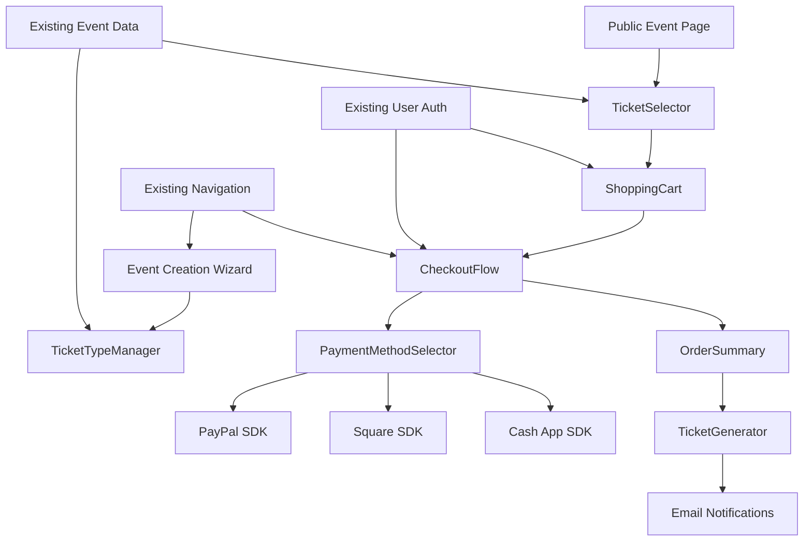

# steppers.com Epic 2.0 Brownfield Enhancement Architecture

## Introduction

This document outlines the architectural approach for enhancing steppers.com with Epic 2.0: Advanced Ticketing & Payment System. Its primary goal is to serve as the guiding architectural blueprint for AI-driven development of new features while ensuring seamless integration with the existing system.

**Relationship to Existing Architecture:**
This document supplements existing project architecture by defining how new payment system components will integrate with current Epic 1.0 systems. Where conflicts arise between new and existing patterns, this document provides guidance on maintaining consistency while implementing sophisticated payment capabilities.

### Existing Project Analysis

Based on my analysis of your stepper-ui-forge project, I've identified the following about your existing system:

**Current Project State:**

- **Primary Purpose:** Comprehensive, multi-tiered events and ticketing platform with Epic 1.0 Core Events System implemented
- **Current Tech Stack:** React 18+ with Vite, TypeScript, Tailwind CSS, shadcn/ui, Supabase BaaS (PostgreSQL, Auth, Storage, Edge Functions)
- **Architecture Style:** BaaS-first architecture with polyrepo approach, utilizing Supabase for backend services
- **Deployment Method:** Frontend hosted on modern platforms (Vercel/Netlify), backend via Supabase infrastructure

**Available Documentation:**

- Comprehensive technical preferences defining React/TypeScript/Tailwind stack
- Architecture documentation including system overview, database schema, and services/APIs
- Existing Epic 2.0 draft PRD with user stories and technical requirements
- Coding standards with ESLint, Prettier, and TypeScript configuration

**Identified Constraints:**

- Must maintain backward compatibility with Epic 1.0 Event Creation Wizard
- PCI DSS compliance requirements for payment processing
- Sub-3 second performance requirements for checkout flows
- 99.9% uptime requirements during high-traffic sales events

### Change Log

| Change | Date | Version | Description | Author |
| ------ | ---- | ------- | ----------- | ------ |
| Initial | TBD | 1.0 | Epic 2.0 Architecture Document Creation | Architect Winston |

## Enhancement Scope and Integration Strategy

### Enhancement Overview

**Enhancement Type:** New Feature Addition + Integration with New Systems
**Scope:** Comprehensive ticketing and payment system with multi-gateway support
**Integration Impact:** Significant Impact - substantial database and API extensions while maintaining Epic 1.0 compatibility

### Integration Approach

**Code Integration Strategy:** Extend existing React component architecture with new ticketing/payment components, following established shadcn/ui patterns and TypeScript conventions

**Database Integration:** Extend Supabase PostgreSQL schema with new tables (ticket_types, tickets, orders, payments, cart_items) while maintaining foreign key relationships to existing events and users tables

**API Integration:** Create new Supabase Edge Functions for payment processing that complement existing event management APIs, utilizing established Row Level Security patterns

**UI Integration:** Develop new components within existing wizard navigation framework, extending Epic 1.0's multi-step pattern for seamless organizer and attendee experiences

### Compatibility Requirements

- **Existing API Compatibility:** All Epic 1.0 Event Creation Wizard endpoints remain functional without modification
- **Database Schema Compatibility:** New payment tables extend existing schema without breaking current event/user relationships
- **UI/UX Consistency:** New payment components follow established shadcn/ui design system and Tailwind CSS patterns
- **Performance Impact:** Payment processing must not exceed current Epic 1.0 performance benchmarks by more than 20%

## Tech Stack Alignment

### Existing Technology Stack

| Category           | Current Technology | Version     | Usage in Enhancement | Notes     |
| :----------------- | :----------------- | :---------- | :------------------- | :-------- |
| **Language**       | TypeScript         | Latest      | All new payment code | Maintains type safety |
| **Runtime**        | Node.js            | Latest LTS  | Supabase Edge Functions | Via Supabase runtime |
| **Framework**      | React              | 18+         | Payment UI components | Existing component patterns |
| **Database**       | PostgreSQL         | Latest      | Payment data storage | Via Supabase managed |
| **API Style**      | REST + GraphQL     | Current     | Payment API endpoints | Supabase Edge Functions |
| **Authentication** | Supabase Auth      | Latest      | Payment user flows | Existing auth integration |
| **Testing**        | Vitest + RTL       | Latest      | Payment component tests | Current testing patterns |
| **Build Tool**     | Vite               | Latest      | Payment code building | No changes needed |

### New Technology Additions

| Technology   | Version     | Purpose     | Rationale     | Integration Method |
| :----------- | :---------- | :---------- | :------------ | :----------------- |
| PayPal SDK   | Latest      | Payment processing | Industry standard gateway | Client-side integration |
| Square SDK   | Latest      | Payment processing | Modern payment platform | Web SDK integration |
| Cash App SDK | Latest      | Mobile payments | Popular mobile payment | API integration |
| Zod schemas  | Latest      | Payment validation | Existing validation pattern | Extend current schemas |

## Data Models and Schema Changes

### New Data Models

### TicketType

**Purpose:** Define different ticket configurations for events (General, VIP, Early Bird, etc.)
**Integration:** Direct foreign key relationship to existing events table

**Key Attributes:**

- id: UUID - Primary key with automatic generation
- event_id: UUID - Foreign key to events table (Epic 1.0 integration)
- name: string - Ticket type name (e.g., "General Admission", "VIP")
- description: text - Detailed ticket description and benefits
- price: decimal - Base ticket price in cents for precision
- early_bird_price: decimal - Optional early bird pricing
- early_bird_until: timestamp - Early bird pricing expiration
- quantity_available: integer - Total tickets available for this type
- quantity_sold: integer - Real-time sold count for inventory management
- is_active: boolean - Enable/disable ticket sales
- created_at: timestamp - Record creation time
- updated_at: timestamp - Last modification time

**Relationships:**

- **With Existing:** Belongs to events (event_id), created by users (via event ownership)
- **With New:** Has many tickets, has many cart_items

### Ticket

**Purpose:** Individual ticket instances purchased by attendees
**Integration:** Links ticket types to orders and provides QR codes for entry

**Key Attributes:**

- id: UUID - Primary key with automatic generation
- ticket_type_id: UUID - Foreign key to ticket_types table
- order_id: UUID - Foreign key to orders table
- attendee_name: string - Name on ticket for entry verification
- attendee_email: string - Contact information for ticket holder
- qr_code: string - Unique QR code for event entry scanning
- status: enum - 'active', 'used', 'refunded', 'cancelled'
- used_at: timestamp - When ticket was scanned for entry
- created_at: timestamp - Ticket generation time

**Relationships:**

- **With Existing:** Belongs to events (via ticket_type), belongs to users (via order)
- **With New:** Belongs to ticket_type, belongs to order

### Order

**Purpose:** Purchase transaction records containing multiple tickets and payment information
**Integration:** Links user purchases to payment processing and ticket generation

**Key Attributes:**

- id: UUID - Primary key with automatic generation
- user_id: UUID - Foreign key to users table (null for guest purchases)
- guest_email: string - Email for guest checkout (when user_id is null)
- subtotal: decimal - Order subtotal before taxes and fees
- tax_amount: decimal - Calculated tax amount
- fee_amount: decimal - Processing fees
- discount_amount: decimal - Applied discount value
- total_amount: decimal - Final total amount charged
- currency: string - Currency code (default 'USD')
- status: enum - 'pending', 'paid', 'failed', 'refunded', 'cancelled'
- payment_intent_id: string - Payment gateway transaction ID
- discount_code: string - Applied promotional code
- created_at: timestamp - Order creation time
- updated_at: timestamp - Last status update

**Relationships:**

- **With Existing:** Belongs to users (user_id, nullable), relates to events (via tickets)
- **With New:** Has many tickets, has one payment, has many cart_items (historical)

### Payment

**Purpose:** Payment processing records and gateway transaction details
**Integration:** Tracks payment attempts and status across multiple gateways

**Key Attributes:**

- id: UUID - Primary key with automatic generation
- order_id: UUID - Foreign key to orders table
- gateway: enum - 'paypal', 'square', 'cashapp'
- gateway_transaction_id: string - Gateway's unique transaction identifier
- amount: decimal - Payment amount in cents
- currency: string - Payment currency
- status: enum - 'pending', 'processing', 'succeeded', 'failed', 'cancelled'
- failure_reason: string - Error details for failed payments
- gateway_response: jsonb - Full gateway response for debugging
- processed_at: timestamp - When payment was completed
- created_at: timestamp - Payment initiation time

**Relationships:**

- **With Existing:** Indirectly related to users via orders
- **With New:** Belongs to order

### CartItem

**Purpose:** Shopping cart persistence for user ticket selections
**Integration:** Maintains cart state across sessions with inventory checks

**Key Attributes:**

- id: UUID - Primary key with automatic generation
- user_id: UUID - Foreign key to users table (null for guest carts)
- session_id: string - Session identifier for guest carts
- ticket_type_id: UUID - Foreign key to ticket_types table
- quantity: integer - Number of tickets in cart
- reserved_until: timestamp - Inventory reservation expiration
- created_at: timestamp - When item was added to cart
- updated_at: timestamp - Last quantity modification

**Relationships:**

- **With Existing:** Belongs to users (user_id, nullable), relates to events (via ticket_type)
- **With New:** Belongs to ticket_type

### Schema Integration Strategy

**Database Changes Required:**

- **New Tables:** ticket_types, tickets, orders, payments, cart_items
- **Modified Tables:** None (preserving Epic 1.0 schema integrity)
- **New Indexes:** Composite indexes on event_id + status, user_id + created_at for performance
- **Migration Strategy:** Incremental schema additions using Supabase migrations with rollback capability

**Backward Compatibility:**

- All existing Epic 1.0 tables remain unchanged and fully functional
- New tables use UUID foreign keys matching existing patterns
- Row Level Security policies extend existing user access patterns

## Component Architecture

The new Epic 2.0 components follow the existing architectural patterns I identified in your codebase: shadcn/ui component composition, React Hook Form integration, and React Query for server state management. The integration interfaces respect your current component structure and wizard navigation patterns.

### New Components

### TicketTypeManager

**Responsibility:** Organizer interface for configuring ticket types within Event Creation Wizard
**Integration Points:** Integrates as new step in existing wizard flow, uses established form patterns

**Key Interfaces:**

- Extends existing wizard navigation component
- Integrates with React Hook Form validation patterns
- Uses established Supabase data mutation patterns

**Dependencies:**

- **Existing Components:** WizardControls, WizardNavigator, existing form components
- **New Components:** TicketTypeForm, PricingCalculator

**Technology Stack:** React + TypeScript, React Hook Form, Zod validation, shadcn/ui components

### TicketSelector

**Responsibility:** Public-facing ticket browsing and selection interface for event attendees
**Integration Points:** Embeds in existing event public pages, maintains responsive design patterns

**Key Interfaces:**

- Real-time inventory display using React Query
- Shopping cart integration via context API
- Mobile-responsive ticket selection cards

**Dependencies:**

- **Existing Components:** Event display components, responsive layout patterns
- **New Components:** ShoppingCartProvider, InventoryDisplay

**Technology Stack:** React + TypeScript, React Query, Tailwind CSS responsive utilities

### ShoppingCart

**Responsibility:** Persistent cart display and management with real-time inventory sync
**Integration Points:** Global cart state using React Context, integrates with existing user session

**Key Interfaces:**

- Cart persistence across browser sessions
- Real-time inventory validation
- Price calculation with taxes and fees

**Dependencies:**

- **Existing Components:** User authentication state, session management
- **New Components:** CartItem, PriceCalculator, InventoryValidator

**Technology Stack:** React Context for state, React Query for server sync, localStorage for persistence

### CheckoutFlow

**Responsibility:** Multi-step payment process with gateway selection and order processing
**Integration Points:** Follows existing wizard pattern, integrates with Supabase authentication

**Key Interfaces:**

- Multi-step wizard navigation matching Epic 1.0 patterns
- Payment gateway abstraction layer
- Order confirmation and ticket generation

**Dependencies:**

- **Existing Components:** WizardNavigator pattern, form validation, user authentication
- **New Components:** PaymentMethodSelector, OrderSummary, TicketGenerator

**Technology Stack:** React Hook Form, payment gateway SDKs, Supabase Edge Functions

### PaymentMethodSelector

**Responsibility:** Payment gateway selection with unified interface across PayPal, Square, Cash App
**Integration Points:** Abstracts gateway complexity, maintains consistent error handling patterns

**Key Interfaces:**

- Gateway-agnostic payment processing
- Consistent error handling and user feedback
- Mobile-optimized payment flows

**Dependencies:**

- **Existing Components:** Error handling patterns, loading states
- **New Components:** PaymentGatewayAbstraction, ErrorBoundary extensions

**Technology Stack:** Payment gateway SDKs, unified TypeScript interfaces

### TicketGenerator

**Responsibility:** Digital ticket creation with QR codes and email delivery
**Integration Points:** Uses existing email notification system, generates tickets post-payment

**Key Interfaces:**

- QR code generation for unique ticket identification
- Email template integration with existing notification system
- PDF ticket generation for download

**Dependencies:**

- **Existing Components:** Email notification system, user preference management
- **New Components:** QRCodeGenerator, TicketTemplate

**Technology Stack:** QR code library, email integration, PDF generation utilities

### Component Interaction Diagram



## API Design and Integration

### New API Endpoints

**API Integration Strategy:** Extend existing Supabase Edge Functions pattern with new payment-specific endpoints
**Authentication:** Integrate with existing Supabase Auth, support both authenticated and guest flows
**Versioning:** Use existing API versioning approach, maintain backward compatibility

#### Create Ticket Type

- **Method:** POST
- **Endpoint:** `/api/v1/ticket-types`
- **Purpose:** Create new ticket type configuration for an event
- **Integration:** Extends existing event management API pattern

**Request:**

```json
{
  "event_id": "uuid",
  "name": "General Admission",
  "description": "Standard event access",
  "price": 2500,
  "early_bird_price": 2000,
  "early_bird_until": "2024-12-01T00:00:00Z",
  "quantity_available": 100
}
```

**Response:**

```json
{
  "id": "uuid",
  "event_id": "uuid",
  "name": "General Admission",
  "price": 2500,
  "quantity_available": 100,
  "quantity_sold": 0,
  "created_at": "2024-01-01T00:00:00Z"
}
```

#### Add to Cart

- **Method:** POST
- **Endpoint:** `/api/v1/cart/items`
- **Purpose:** Add ticket selections to shopping cart with inventory reservation
- **Integration:** Uses existing user session management, supports guest checkout

**Request:**

```json
{
  "ticket_type_id": "uuid",
  "quantity": 2,
  "session_id": "guest_session_uuid"
}
```

**Response:**

```json
{
  "id": "uuid",
  "ticket_type_id": "uuid",
  "quantity": 2,
  "reserved_until": "2024-01-01T01:00:00Z",
  "subtotal": 5000
}
```

#### Process Payment

- **Method:** POST
- **Endpoint:** `/api/v1/checkout/process`
- **Purpose:** Process payment through selected gateway and create order
- **Integration:** Orchestrates payment, order creation, and ticket generation

**Request:**

```json
{
  "cart_items": ["cart_item_uuid_1", "cart_item_uuid_2"],
  "payment_method": "paypal",
  "billing_info": {
    "email": "customer@example.com",
    "name": "John Doe"
  },
  "discount_code": "EARLY2024"
}
```

**Response:**

```json
{
  "order_id": "uuid",
  "payment_intent_id": "gateway_transaction_id",
  "status": "processing",
  "total_amount": 4500,
  "redirect_url": "https://paypal.com/checkout/..."
}
```

#### Generate Tickets

- **Method:** POST
- **Endpoint:** `/api/v1/orders/{order_id}/tickets`
- **Purpose:** Generate digital tickets with QR codes after successful payment
- **Integration:** Triggered by payment webhook, integrates with email system

**Request:**

```json
{
  "attendee_details": [
    {
      "ticket_type_id": "uuid",
      "name": "John Doe",
      "email": "john@example.com"
    }
  ]
}
```

**Response:**

```json
{
  "tickets": [
    {
      "id": "uuid",
      "qr_code": "unique_qr_string",
      "ticket_type": "General Admission",
      "event_name": "Epic Concert",
      "event_date": "2024-06-01T19:00:00Z"
    }
  ],
  "email_sent": true
}
```

## External API Integration

### PayPal API

- **Purpose:** Process PayPal payments and handle PayPal Credit options
- **Documentation:** https://developer.paypal.com/docs/api/overview/
- **Base URL:** https://api.paypal.com (production), https://api.sandbox.paypal.com (sandbox)
- **Authentication:** OAuth 2.0 with client credentials
- **Integration Method:** Client-side PayPal Checkout SDK with server-side order verification

**Key Endpoints Used:**

- `POST /v2/checkout/orders` - Create payment order
- `POST /v2/checkout/orders/{id}/capture` - Capture payment
- `POST /v1/notifications/webhooks` - Payment status webhooks

**Error Handling:** Unified error abstraction with user-friendly messages, automatic retry for network failures

### Square API

- **Purpose:** Process credit/debit card payments with PCI compliance via Square
- **Documentation:** https://developer.squareup.com/docs
- **Base URL:** https://connect.squareup.com (production), https://connect.squareupsandbox.com (sandbox)
- **Authentication:** Bearer token with OAuth 2.0 support
- **Integration Method:** Square Web Payments SDK for secure card tokenization

**Key Endpoints Used:**

- `POST /v2/payments` - Process card payment
- `POST /v2/refunds` - Process refunds
- `POST /v2/webhooks` - Payment event notifications

**Error Handling:** Square-specific error codes mapped to consistent user messages, PCI-compliant error logging

### Cash App API

- **Purpose:** Enable Cash App Pay for mobile-optimized checkout experience
- **Documentation:** https://developers.cash.app/docs
- **Base URL:** https://api.cash.app (production), https://sandbox.api.cash.app (sandbox)
- **Authentication:** API key with webhook signature verification
- **Integration Method:** Cash App Pay SDK with QR code fallback for desktop

**Key Endpoints Used:**

- `POST /v1/payments` - Create Cash App payment request
- `GET /v1/payments/{id}` - Check payment status
- `POST /v1/webhooks` - Payment completion webhooks

**Error Handling:** Mobile-specific error handling with graceful fallback to alternative payment methods

## Source Tree Integration

### Existing Project Structure

```plaintext
src/
├── components/
│   ├── create-event/
│   │   ├── wizard/
│   │   │   ├── WizardControls.tsx
│   │   │   └── WizardNavigator.tsx
│   └── ui/
├── hooks/
│   └── useWizardNavigation.ts
├── pages/
│   └── CreateEvent.tsx
└── lib/
```

### New File Organization

```plaintext
src/
├── components/
│   ├── create-event/
│   │   ├── wizard/
│   │   │   ├── WizardControls.tsx          # Existing
│   │   │   ├── WizardNavigator.tsx         # Existing
│   │   │   └── TicketConfigurationStep.tsx # New Epic 2.0 step
│   ├── ticketing/                          # New Epic 2.0 components
│   │   ├── TicketTypeManager.tsx
│   │   ├── TicketSelector.tsx
│   │   ├── TicketCard.tsx
│   │   └── PricingCalculator.tsx
│   ├── cart/                               # Shopping cart components
│   │   ├── ShoppingCart.tsx
│   │   ├── CartItem.tsx
│   │   ├── CartSummary.tsx
│   │   └── CartProvider.tsx
│   ├── checkout/                           # Checkout flow components
│   │   ├── CheckoutFlow.tsx
│   │   ├── PaymentMethodSelector.tsx
│   │   ├── OrderSummary.tsx
│   │   └── OrderConfirmation.tsx
│   └── payments/                           # Payment gateway integrations
│       ├── PayPalPayment.tsx
│       ├── SquarePayment.tsx
│       ├── CashAppPayment.tsx
│       └── PaymentGatewayAbstraction.ts
├── hooks/
│   ├── useWizardNavigation.ts              # Existing
│   ├── useCart.ts                          # Shopping cart state
│   ├── usePaymentGateway.ts               # Payment processing
│   └── useTicketInventory.ts              # Real-time inventory
├── lib/
│   ├── payments/                           # Payment utilities
│   │   ├── paypal-client.ts
│   │   ├── square-client.ts
│   │   ├── cashapp-client.ts
│   │   └── payment-types.ts
│   └── validations/
│       ├── ticket-schemas.ts               # Zod schemas for tickets
│       ├── payment-schemas.ts              # Payment validation
│       └── cart-schemas.ts                 # Cart validation
└── types/
    ├── ticket.ts                           # TypeScript types
    ├── payment.ts                          # Payment interfaces
    └── cart.ts                             # Cart type definitions
```

### Integration Guidelines

- **File Naming:** Continue kebab-case for files, PascalCase for React components
- **Folder Organization:** Group by feature (ticketing, cart, checkout, payments) following existing patterns
- **Import/Export Patterns:** Use index.ts files for clean imports, maintain existing barrel export patterns

## Infrastructure and Deployment Integration

### Existing Infrastructure

**Current Deployment:** Frontend deployed to modern hosting platform (Vercel/Netlify), backend via Supabase managed infrastructure
**Infrastructure Tools:** Supabase for database, authentication, storage, and Edge Functions
**Environments:** Development, staging, and production environments managed through Supabase dashboard

### Enhancement Deployment Strategy

**Deployment Approach:** Incremental deployment using feature flags to enable Epic 2.0 components gradually
**Infrastructure Changes:** Additional Supabase Edge Functions for payment processing, webhook endpoints for payment gateways
**Pipeline Integration:** Extend existing CI/CD pipeline with payment gateway environment variables and PCI compliance checks

### Rollback Strategy

**Rollback Method:** Feature flag toggles for immediate Epic 2.0 disabling, database migrations with rollback scripts
**Risk Mitigation:** Canary deployment for payment features, comprehensive monitoring of payment success rates
**Monitoring:** Enhanced logging for payment processing, real-time alerts for payment failures and performance degradation

## Coding Standards and Conventions

### Existing Standards Compliance

**Code Style:** TypeScript with strict mode, ESLint with React and TypeScript rules, Prettier formatting
**Linting Rules:** Existing ESLint configuration with React hooks rules, import ordering, and TypeScript strict checks
**Testing Patterns:** Vitest with React Testing Library, component isolation testing, mock payment gateways in tests
**Documentation Style:** TSDoc comments for public interfaces, README files for major features

### Enhancement-Specific Standards

- **Payment Security:** Never log sensitive payment data, use environment variables for all API keys, implement proper error boundaries for payment flows
- **Type Safety:** Strict TypeScript for all payment interfaces, Zod schemas for runtime validation, branded types for monetary values
- **Error Handling:** Consistent error boundaries for payment failures, user-friendly error messages, comprehensive error logging for debugging

### Critical Integration Rules

- **Existing API Compatibility:** All Epic 1.0 endpoints must continue functioning, no breaking changes to existing response formats
- **Database Integration:** All new tables use existing UUID patterns, Row Level Security policies follow established patterns
- **Error Handling:** Payment errors integrate with existing error handling system, maintain consistent user experience
- **Logging Consistency:** Payment logs use existing logging format with enhanced security filtering for sensitive data

## Testing Strategy

### Integration with Existing Tests

**Existing Test Framework:** Vitest with React Testing Library for component testing
**Test Organization:** Tests colocated with components, integration tests in separate directory
**Coverage Requirements:** Maintain existing coverage standards, critical payment flows require 100% coverage

### New Testing Requirements

#### Unit Tests for New Components

- **Framework:** Vitest with React Testing Library
- **Location:** Adjacent to component files (component.test.tsx)
- **Coverage Target:** 90% minimum for payment components, 100% for critical payment logic
- **Integration with Existing:** Use existing test utilities, extend mock patterns for payment gateways

#### Integration Tests

- **Scope:** End-to-end payment flows, shopping cart to ticket generation
- **Existing System Verification:** Ensure Epic 1.0 functionality remains intact during payment testing
- **New Feature Testing:** Complete checkout flows with mock payment gateways, inventory management under load

#### Regression Testing

- **Existing Feature Verification:** Automated regression suite for Epic 1.0 Event Creation Wizard
- **Automated Regression Suite:** Payment flow regression tests, cart state persistence tests
- **Manual Testing Requirements:** Payment gateway integrations in sandbox environments, mobile payment flow testing

## Security Integration

### Existing Security Measures

**Authentication:** Supabase Auth with JWT tokens, social login providers
**Authorization:** Row Level Security (RLS) policies for data access control
**Data Protection:** HTTPS encryption, environment variable management
**Security Tools:** Supabase built-in security features, ESLint security rules

### Enhancement Security Requirements

**New Security Measures:** PCI DSS Level 1 compliance for payment processing, payment gateway tokenization, secure webhook signature verification
**Integration Points:** Payment security integrates with existing authentication, encrypted payment data storage
**Compliance Requirements:** PCI DSS, GDPR for payment data, SOC 2 for infrastructure security

### Security Testing

**Existing Security Tests:** Authentication flow tests, authorization boundary tests
**New Security Test Requirements:** Payment tokenization tests, webhook signature verification, PCI compliance validation
**Penetration Testing:** Payment endpoint security testing, input validation for payment data

## Risk Assessment and Mitigation

### Technical Risks

**Risk:** Payment gateway API changes breaking integrations
**Impact:** High
**Likelihood:** Medium
**Mitigation:** Payment gateway abstraction layer enables quick provider switching, comprehensive monitoring alerts for API failures

**Risk:** Real-time inventory conflicts during high-traffic sales
**Impact:** High
**Likelihood:** Medium
**Mitigation:** Database transactions with atomic operations, reservation system with time-based locks, queue system for high-volume sales

**Risk:** PCI compliance violations exposing sensitive payment data
**Impact:** Critical
**Likelihood:** Low
**Mitigation:** Never store sensitive payment data locally, use payment gateway tokenization, regular security audits

### Operational Risks

**Risk:** Payment processing downtime affecting customer experience
**Impact:** High
**Likelihood:** Low
**Mitigation:** Multiple payment gateway failover, comprehensive uptime monitoring, clear customer communication during outages

**Risk:** Database migration failures corrupting existing Epic 1.0 data
**Impact:** Critical
**Likelihood:** Low
**Mitigation:** Comprehensive migration testing, database backups before migrations, rollback procedures tested in staging

### Monitoring and Alerting

**Enhanced Monitoring:** Payment success/failure rates, checkout abandonment metrics, gateway response times
**New Alerts:** Payment processing failures, inventory conflicts, unusual transaction patterns
**Performance Monitoring:** Sub-3 second checkout requirement monitoring, database query performance for payment operations

## Next Steps

### Story Manager Handoff

This comprehensive architecture document provides the technical foundation for Epic 2.0 implementation. The Story Manager should reference this architecture when breaking down user stories, ensuring each story maintains integration requirements with existing Epic 1.0 systems. Key integration requirements have been validated through existing project analysis, and system constraints are based on actual project architecture. The first story should implement TicketTypeManager integration with the existing Event Creation Wizard, with clear integration checkpoints to verify Epic 1.0 functionality remains intact throughout implementation.

### Developer Handoff

Developers beginning Epic 2.0 implementation should reference this architecture document alongside existing coding standards analyzed from the actual project. Integration requirements with the existing React/TypeScript/Supabase codebase have been validated through project analysis. Key technical decisions are based on real project constraints including PCI compliance, performance requirements, and existing wizard navigation patterns. Implementation should follow the sequenced approach outlined in the comprehensive PRD, with existing system compatibility requirements and specific verification steps for each component. Clear implementation sequencing minimizes risk to existing Epic 1.0 functionality while building sophisticated payment capabilities.