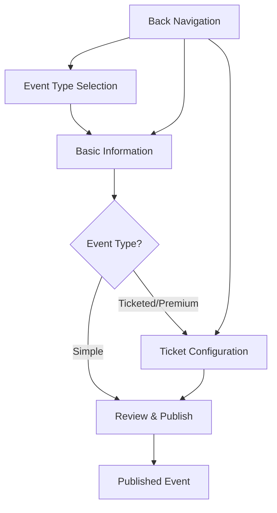

# Frontend Specification: Event Wizard Navigation Enhancement
## Story 1.3 - Professional UI/UX Implementation

**Version:** 1.0  
**Date:** 2025-06-29  
**Status:** Draft  
**Author:** UX Expert  

---

## 1. Executive Summary

This specification defines the enhanced UI/UX implementation for Story 1.3: Event Wizard Navigation Enhancement. Building upon the existing 40% implementation, this enhancement will transform the basic wizard navigation into a world-class, professional user interface that significantly improves the event creation experience.

### Key Enhancement Goals
- Transform basic step indicators into professional visual navigation
- Implement smooth animations and micro-interactions
- Enhance mobile responsiveness and touch interactions
- Improve accessibility to WCAG 2.1 AA standards
- Integrate seamlessly with existing shadcn/ui design system
- Provide clear progress indication and context awareness

---

## 2. Current State Analysis

### Existing Implementation (40% Complete)
- **WizardNavigator Component**: Basic step indicators with progress bar
- **WizardControls Component**: Navigation buttons with validation feedback
- **useWizardNavigation Hook**: Step management and validation logic
- **Step Components**: EventTypeSelection, BasicInformation, TicketConfiguration, ReviewStep

### Current Strengths
- Solid foundation with proper TypeScript interfaces
- Functional step validation and navigation logic
- Integration with react-hook-form validation
- Responsive grid layouts in step components
- Basic progress tracking

### Current Limitations
- Limited visual hierarchy and polish
- Basic animations and transitions
- Mobile experience needs enhancement
- Accessibility improvements needed
- Limited micro-interactions and feedback
- No advanced loading states or skeleton screens

---

## 3. Design System Integration

### 3.1 Color Palette
Building on existing CSS variables and shadcn/ui tokens:

```css
/* Primary Navigation Colors */
--wizard-primary: hsl(var(--primary))           /* #4F46E5 */
--wizard-primary-hover: hsl(var(--primary)/90)  /* #4338CA */
--wizard-completed: hsl(142, 76%, 36%)          /* #16A34A */
--wizard-current: hsl(var(--primary))           /* #4F46E5 */
--wizard-pending: hsl(var(--muted-foreground))  /* #6B7280 */
--wizard-disabled: hsl(var(--muted))            /* #F3F4F6 */

/* Progress Indicators */
--wizard-progress-bg: hsl(var(--muted))         /* #F3F4F6 */
--wizard-progress-fill: hsl(var(--primary))     /* #4F46E5 */
--wizard-connection-line: hsl(var(--border))    /* #E5E7EB */

/* Interactive States */
--wizard-hover: hsl(var(--accent))              /* #F1F5F9 */
--wizard-focus: hsl(var(--ring))                /* #4F46E5 */
--wizard-error: hsl(var(--destructive))         /* #EF4444 */
```

### 3.2 Typography System
Following existing font hierarchy:

```css
/* Step Titles */
.wizard-step-title {
  font-family: var(--font-sans);
  font-size: 0.875rem;      /* 14px */
  font-weight: 500;
  line-height: 1.25rem;     /* 20px */
}

/* Step Descriptions */
.wizard-step-description {
  font-family: var(--font-sans);
  font-size: 0.75rem;       /* 12px */
  font-weight: 400;
  line-height: 1rem;        /* 16px */
}

/* Progress Labels */
.wizard-progress-label {
  font-family: var(--font-sans);
  font-size: 0.875rem;      /* 14px */
  font-weight: 500;
}
```

### 3.3 Spacing System (Tailwind Scale)
- **Micro spacing**: `space-1` (4px) - Between icons and text
- **Component spacing**: `space-3` to `space-4` (12px-16px) - Between UI elements
- **Section spacing**: `space-6` to `space-8` (24px-32px) - Between major sections
- **Layout spacing**: `space-12` to `space-16` (48px-64px) - Between major layouts

---

## 4. Component Specifications

### 4.1 Enhanced WizardNavigator Component

#### Visual Enhancements
```typescript
interface WizardNavigatorProps {
  steps: WizardStep[];
  currentStep: number;
  getStepStatus: (stepIndex: number) => StepStatus;
  onStepClick: (stepNumber: number) => void;
  variant?: 'default' | 'compact' | 'minimal';
  showProgressBar?: boolean;
  showStepNumbers?: boolean;
  animationDuration?: number;
}

type StepStatus = 'completed' | 'current' | 'pending' | 'error' | 'disabled';
```

#### Desktop Layout (Default)
- **Progress Bar**: Enhanced with gradient fill and smooth animation
- **Step Indicators**: Larger touch targets (48px minimum)
- **Connection Lines**: Animated progress indication
- **Step Labels**: Clear hierarchy with title and description
- **Interactive States**: Hover, focus, and active states

#### Mobile Layout (< 768px)
```css
@media (max-width: 767px) {
  .wizard-navigator {
    /* Compact horizontal scroll on mobile */
    display: flex;
    overflow-x: auto;
    scroll-snap-type: x mandatory;
    padding: 0 16px;
  }
  
  .wizard-step {
    flex: 0 0 auto;
    scroll-snap-align: center;
    min-width: 120px;
  }
}
```

#### Tablet Layout (768px - 1024px)
- Responsive step sizing
- Optimized touch targets
- Balanced spacing

### 4.2 Enhanced WizardControls Component

#### Button States and Variants
```typescript
interface WizardControlsProps {
  canGoBack: boolean;
  canGoForward: boolean;
  onBack: () => void;
  onNext: () => void;
  isFirstStep: boolean;
  isLastStep: boolean;
  isLoading?: boolean;
  errors?: ValidationError[];
  nextButtonText?: string;
  backButtonText?: string;
  showProgress?: boolean;
  loadingText?: string;
}

interface ValidationError {
  field: string;
  message: string;
  severity: 'error' | 'warning';
}
```

#### Button Specifications
- **Primary Action Button**: Next/Continue/Publish
  - Default state: Primary color with subtle shadow
  - Hover state: Darker shade with lifted shadow
  - Loading state: Spinner with progress text
  - Disabled state: Muted colors with reduced opacity

- **Secondary Action Button**: Back/Previous
  - Outline variant with hover states
  - Clear visual hierarchy (less prominent than primary)

#### Error Handling Enhancement
- **Inline Validation**: Real-time field validation feedback
- **Error Summary**: Grouped error display with severity indicators
- **Progressive Enhancement**: Contextual help and suggestions

### 4.3 Step Component Enhancements

#### Enhanced EventTypeSelection
- **Card Hover Effects**: Subtle lift and shadow animation
- **Selection Animation**: Smooth scale and color transitions
- **Loading States**: Skeleton placeholders during data loading
- **Improved Imagery**: Consistent icon treatment and spacing

#### Enhanced BasicInformation
- **Form Field Grouping**: Visual separation of related fields
- **Image Upload Enhancement**: Drag-and-drop area with progress indicators
- **Category Selection**: Improved chip-style category selector
- **Validation Feedback**: Inline validation with contextual messages

---

## 5. Interaction Design

### 5.1 Navigation Flow


### 5.2 Micro-Interactions

#### Step Transition Animations
```css
/* Step change animation */
.wizard-step-enter {
  opacity: 0;
  transform: translateX(24px);
  transition: all 0.3s cubic-bezier(0.4, 0, 0.2, 1);
}

.wizard-step-enter-active {
  opacity: 1;
  transform: translateX(0);
}

.wizard-step-exit {
  opacity: 1;
  transform: translateX(0);
  transition: all 0.3s cubic-bezier(0.4, 0, 0.2, 1);
}

.wizard-step-exit-active {
  opacity: 0;
  transform: translateX(-24px);
}
```

#### Progress Animation
```css
/* Progress bar fill animation */
.wizard-progress-fill {
  transition: width 0.6s cubic-bezier(0.65, 0, 0.35, 1);
  background: linear-gradient(90deg, 
    hsl(var(--primary)) 0%,
    hsl(var(--primary)/80) 100%
  );
}

/* Step indicator completion animation */
.wizard-step-complete {
  animation: stepComplete 0.4s cubic-bezier(0.68, -0.55, 0.265, 1.55);
}

@keyframes stepComplete {
  0% { transform: scale(1); }
  50% { transform: scale(1.1); }
  100% { transform: scale(1); }
}
```

#### Button Interaction Feedback
```css
/* Button press feedback */
.wizard-button:active {
  transform: translateY(1px);
  transition: transform 0.1s ease-in-out;
}

/* Loading state pulse */
.wizard-button-loading {
  animation: pulse 2s cubic-bezier(0.4, 0, 0.6, 1) infinite;
}
```

### 5.3 Touch Interactions (Mobile)

#### Gesture Support
- **Swipe Navigation**: Optional left/right swipe between steps
- **Touch Feedback**: Haptic feedback on step completion (iOS)
- **Pull-to-Refresh**: Refresh draft data (if applicable)

#### Touch Target Optimization
- Minimum 44px touch targets
- Adequate spacing between interactive elements
- Clear visual feedback for touch interactions

---

## 6. Responsive Design Specifications

### 6.1 Breakpoint Strategy
Following Tailwind's responsive system:

```typescript
const breakpoints = {
  sm: '640px',   // Small devices (landscape phones)
  md: '768px',   // Medium devices (tablets)
  lg: '1024px',  // Large devices (desktops)
  xl: '1280px',  // Extra large devices
  '2xl': '1536px' // Extra extra large devices
};
```

### 6.2 Mobile-First Implementation

#### Mobile (< 640px)
```css
.wizard-container {
  padding: 16px;
  max-width: 100%;
}

.wizard-navigator {
  /* Horizontal scroll with snap points */
  display: flex;
  overflow-x: auto;
  scroll-snap-type: x mandatory;
  gap: 8px;
  padding-bottom: 8px;
}

.wizard-step-card {
  /* Full width on mobile */
  width: 100%;
  margin-bottom: 16px;
}

.wizard-controls {
  /* Stacked buttons on mobile */
  flex-direction: column;
  gap: 12px;
}
```

#### Tablet (640px - 1024px)
```css
.wizard-container {
  padding: 24px;
  max-width: 768px;
  margin: 0 auto;
}

.wizard-navigator {
  /* Horizontal layout with proper spacing */
  display: flex;
  justify-content: space-between;
  gap: 16px;
}

.wizard-controls {
  /* Horizontal button layout */
  flex-direction: row;
  justify-content: space-between;
}
```

#### Desktop (1024px+)
```css
.wizard-container {
  padding: 32px;
  max-width: 1024px;
  margin: 0 auto;
}

.wizard-navigator {
  /* Full horizontal layout with descriptions */
  display: flex;
  justify-content: space-between;
  align-items: flex-start;
}

.wizard-step-description {
  /* Show full descriptions on desktop */
  display: block;
}
```

### 6.3 Component Responsive Behavior

#### WizardNavigator Responsive Variants
- **Mobile**: Compact horizontal scroll
- **Tablet**: Balanced horizontal layout
- **Desktop**: Full-featured with descriptions

#### Form Layout Adaptations
- **Mobile**: Single column, stacked inputs
- **Tablet**: Mixed single/dual column based on field type
- **Desktop**: Optimized dual-column where appropriate

---

## 7. Accessibility Design (WCAG 2.1 AA)

### 7.1 Keyboard Navigation
```typescript
const keyboardHandlers = {
  'ArrowLeft': () => canGoBack && goToPreviousStep(),
  'ArrowRight': () => canGoForward && goToNextStep(),
  'Enter': (e) => {
    if (e.target.matches('.wizard-step-button')) {
      activateStep(e.target.dataset.step);
    }
  },
  'Space': (e) => {
    e.preventDefault();
    if (e.target.matches('.wizard-step-button')) {
      activateStep(e.target.dataset.step);
    }
  },
  'Home': () => goToStep(1),
  'End': () => goToStep(totalSteps),
};
```

### 7.2 Screen Reader Support
```html
<!-- Enhanced semantic markup -->
<nav role="navigation" aria-label="Event creation wizard">
  <ol className="wizard-steps" role="list">
    <li role="listitem">
      <button
        role="tab"
        aria-selected={isCurrentStep}
        aria-controls={`step-panel-${stepId}`}
        aria-describedby={`step-description-${stepId}`}
        tabIndex={isCurrentStep ? 0 : -1}
      >
        <span className="wizard-step-title">
          {stepTitle}
        </span>
        <span 
          id={`step-description-${stepId}`}
          className="wizard-step-description"
        >
          {stepDescription}
        </span>
      </button>
    </li>
  </ol>
</nav>

<!-- Step content with proper labeling -->
<div
  id={`step-panel-${stepId}`}
  role="tabpanel"
  aria-labelledby={`step-${stepId}`}
  tabIndex="0"
>
  <!-- Step content -->
</div>
```

### 7.3 Visual Accessibility
```css
/* High contrast mode support */
@media (prefers-contrast: high) {
  .wizard-step-current {
    border: 3px solid;
    background: ButtonFace;
    color: ButtonText;
  }
  
  .wizard-step-completed {
    background: Highlight;
    color: HighlightText;
  }
}

/* Reduced motion support */
@media (prefers-reduced-motion: reduce) {
  .wizard-step-enter,
  .wizard-step-exit,
  .wizard-progress-fill {
    transition: none;
  }
  
  .wizard-step-complete {
    animation: none;
  }
}

/* Focus indicators */
.wizard-step-button:focus-visible {
  outline: 2px solid hsl(var(--ring));
  outline-offset: 2px;
  border-radius: 4px;
}
```

### 7.4 Error Announcement
```typescript
// Live region for dynamic error announcements
const announceError = (message: string) => {
  const liveRegion = document.getElementById('wizard-live-region');
  if (liveRegion) {
    liveRegion.textContent = message;
    // Clear after announcement
    setTimeout(() => {
      liveRegion.textContent = '';
    }, 1000);
  }
};
```

---

## 8. Animation & Transition Specifications

### 8.1 Animation Principles
- **Duration**: 200-600ms for most interactions
- **Easing**: CSS cubic-bezier functions for natural motion
- **Purpose**: Enhance understanding, not distract
- **Performance**: Hardware-accelerated properties only

### 8.2 Transition Catalog

#### Page Transitions
```css
/* Step change animation */
.wizard-page-transition {
  --duration: 400ms;
  --easing: cubic-bezier(0.4, 0, 0.2, 1);
}

.page-enter {
  opacity: 0;
  transform: translateX(2rem);
  transition: all var(--duration) var(--easing);
}

.page-enter-active {
  opacity: 1;
  transform: translateX(0);
}

.page-exit {
  opacity: 1;
  transform: translateX(0);
  transition: all var(--duration) var(--easing);
}

.page-exit-active {
  opacity: 0;
  transform: translateX(-1rem);
}
```

#### Loading States
```css
/* Skeleton loading animation */
.wizard-skeleton {
  background: linear-gradient(
    90deg,
    hsl(var(--muted)) 25%,
    hsl(var(--muted)/50) 50%,
    hsl(var(--muted)) 75%
  );
  background-size: 200% 100%;
  animation: skeletonLoading 1.5s infinite;
}

@keyframes skeletonLoading {
  0% { background-position: 200% 0; }
  100% { background-position: -200% 0; }
}

/* Button loading state */
.wizard-button-loading {
  position: relative;
  color: transparent;
}

.wizard-button-loading::after {
  content: '';
  position: absolute;
  top: 50%;
  left: 50%;
  width: 16px;
  height: 16px;
  margin: -8px 0 0 -8px;
  border: 2px solid currentColor;
  border-right-color: transparent;
  border-radius: 50%;
  animation: spin 0.8s linear infinite;
}
```

#### Progress Animations
```css
/* Progress bar fill */
.wizard-progress-bar {
  overflow: hidden;
  background: hsl(var(--muted));
  border-radius: 9999px;
}

.wizard-progress-fill {
  height: 100%;
  background: linear-gradient(
    90deg,
    hsl(var(--primary)),
    hsl(var(--primary)/80)
  );
  border-radius: inherit;
  transition: width 0.6s cubic-bezier(0.65, 0, 0.35, 1);
  position: relative;
}

/* Animated progress shine effect */
.wizard-progress-fill::after {
  content: '';
  position: absolute;
  top: 0;
  left: 0;
  right: 0;
  bottom: 0;
  background: linear-gradient(
    90deg,
    transparent,
    rgba(255, 255, 255, 0.2),
    transparent
  );
  animation: progressShine 2s infinite;
}

@keyframes progressShine {
  0% { transform: translateX(-100%); }
  100% { transform: translateX(100%); }
}
```

### 8.3 Performance Optimization
```css
/* Hardware acceleration for smooth animations */
.wizard-animated-element {
  will-change: transform, opacity;
  transform: translateZ(0); /* Force hardware acceleration */
}

/* Optimize repaints */
.wizard-step-indicator {
  contain: layout style paint;
}
```

---

## 9. Error States & Recovery

### 9.1 Error Classification
```typescript
interface ValidationError {
  type: 'required' | 'format' | 'constraint' | 'server';
  severity: 'error' | 'warning' | 'info';
  field: string;
  message: string;
  suggestions?: string[];
  recoveryAction?: {
    label: string;
    action: () => void;
  };
}
```

### 9.2 Error Display Patterns

#### Inline Field Errors
```tsx
<div className="wizard-field-group">
  <Input
    className={cn(
      "wizard-input",
      error && "border-destructive focus:border-destructive"
    )}
    aria-invalid={!!error}
    aria-describedby={error ? `${fieldId}-error` : undefined}
  />
  {error && (
    <div 
      id={`${fieldId}-error`}
      className="wizard-field-error"
      role="alert"
    >
      <AlertCircle className="w-4 h-4" />
      <span>{error.message}</span>
      {error.suggestions && (
        <ul className="wizard-error-suggestions">
          {error.suggestions.map((suggestion, index) => (
            <li key={index}>{suggestion}</li>
          ))}
        </ul>
      )}
    </div>
  )}
</div>
```

#### Step-Level Error Summary
```tsx
<Alert variant="destructive" className="wizard-step-errors">
  <AlertCircle className="h-4 w-4" />
  <AlertTitle>Please resolve the following issues:</AlertTitle>
  <AlertDescription>
    <ul className="space-y-1 mt-2">
      {errors.map((error, index) => (
        <li key={index} className="flex items-start gap-2">
          <span className="font-medium">{error.field}:</span>
          <span>{error.message}</span>
          {error.recoveryAction && (
            <Button
              variant="link"
              size="sm"
              onClick={error.recoveryAction.action}
              className="h-auto p-0 text-xs underline"
            >
              {error.recoveryAction.label}
            </Button>
          )}
        </li>
      ))}
    </ul>
  </AlertDescription>
</Alert>
```

### 9.3 Error Recovery Patterns

#### Auto-Save Recovery
```typescript
const handleErrorRecovery = {
  // Auto-save validation errors
  autoSave: () => {
    const draftData = loadDraftFromStorage();
    if (draftData) {
      form.reset(draftData);
      showRecoveryMessage('Draft restored from auto-save');
    }
  },
  
  // Clear validation and retry
  clearAndRetry: (fieldName: string) => {
    form.clearErrors(fieldName);
    form.trigger(fieldName);
  },
  
  // Skip optional field
  skipOptional: (fieldName: string) => {
    form.setValue(fieldName, undefined);
    proceedToNextStep();
  }
};
```

#### Network Error Handling
```tsx
const NetworkErrorBoundary = ({ children }: { children: React.ReactNode }) => {
  const [hasError, setHasError] = useState(false);
  const [retryCount, setRetryCount] = useState(0);

  const handleRetry = () => {
    setHasError(false);
    setRetryCount(prev => prev + 1);
  };

  if (hasError) {
    return (
      <Card className="wizard-error-boundary">
        <CardHeader>
          <CardTitle className="flex items-center gap-2">
            <AlertCircle className="w-5 h-5 text-destructive" />
            Connection Error
          </CardTitle>
        </CardHeader>
        <CardContent className="space-y-4">
          <p>Unable to save your progress. Please check your connection and try again.</p>
          <div className="flex gap-2">
            <Button onClick={handleRetry} variant="outline">
              Try Again ({retryCount + 1}/3)
            </Button>
            <Button onClick={() => saveAsDraft()} variant="secondary">
              Save as Draft
            </Button>
          </div>
        </CardContent>
      </Card>
    );
  }

  return <>{children}</>;
};
```

---

## 10. Performance Specifications

### 10.1 Loading Performance Targets
- **Initial Load**: < 2 seconds to first meaningful paint
- **Step Transitions**: < 300ms transition time
- **Form Interactions**: < 100ms response time
- **Image Upload**: Progressive loading with feedback

### 10.2 Optimization Strategies

#### Code Splitting
```typescript
// Lazy load step components
const EventTypeSelection = lazy(() => 
  import('@/components/create-event/EventTypeSelection')
);
const BasicInformation = lazy(() => 
  import('@/components/create-event/BasicInformation')
);
const TicketConfiguration = lazy(() => 
  import('@/components/create-event/TicketConfiguration')
);

// Preload next step component
const preloadNextStep = (nextStepComponent: string) => {
  import(`@/components/create-event/${nextStepComponent}`);
};
```

#### Image Optimization
```typescript
const ImageUploadOptimized = {
  // Progressive loading
  placeholder: 'blur',
  blurDataURL: 'data:image/jpeg;base64,/9j/4AAQSkZJRgABA...',
  
  // Responsive images
  sizes: '(max-width: 768px) 100vw, (max-width: 1200px) 50vw, 33vw',
  
  // Lazy loading
  loading: 'lazy' as const,
  
  // Optimize delivery
  quality: 85,
  format: 'webp'
};
```

#### Bundle Size Optimization
```typescript
// Tree-shaking friendly imports
import { Button } from '@/components/ui/button';
import { Card, CardContent, CardHeader } from '@/components/ui/card';

// Avoid importing entire icon libraries
import { ChevronRight, Check, AlertCircle } from 'lucide-react';
```

### 10.3 Memory Management
```typescript
// Cleanup on component unmount
useEffect(() => {
  return () => {
    // Clear auto-save intervals
    clearInterval(autoSaveInterval);
    // Cancel pending requests
    abortController.abort();
    // Clear form data if needed
    if (shouldClearOnUnmount) {
      form.reset();
    }
  };
}, []);
```

---

## 11. Testing Specifications

### 11.1 Visual Regression Testing
```typescript
// Storybook stories for component states
export const WizardNavigatorStates = {
  Default: () => <WizardNavigator {...defaultProps} />,
  WithErrors: () => <WizardNavigator {...propsWithErrors} />,
  Loading: () => <WizardNavigator {...loadingProps} />,
  Mobile: () => <WizardNavigator {...mobileProps} />,
  HighContrast: () => <WizardNavigator {...highContrastProps} />,
};

// Visual regression test scenarios
const visualTests = [
  'wizard-navigator-default',
  'wizard-navigator-mobile',
  'wizard-navigator-with-errors',
  'wizard-navigator-loading',
  'wizard-controls-all-states',
  'step-transitions-animation'
];
```

### 11.2 Accessibility Testing
```typescript
// Jest + React Testing Library
describe('WizardNavigator Accessibility', () => {
  test('supports keyboard navigation', async () => {
    render(<WizardNavigator {...props} />);
    
    const firstStep = screen.getByRole('tab', { name: /event type/i });
    firstStep.focus();
    
    // Test arrow key navigation
    fireEvent.keyDown(firstStep, { key: 'ArrowRight' });
    expect(screen.getByRole('tab', { name: /event details/i })).toHaveFocus();
    
    // Test enter key activation
    fireEvent.keyDown(document.activeElement, { key: 'Enter' });
    expect(mockOnStepClick).toHaveBeenCalledWith(2);
  });
  
  test('announces step changes to screen readers', () => {
    const { rerender } = render(<WizardNavigator currentStep={1} {...props} />);
    
    rerender(<WizardNavigator currentStep={2} {...props} />);
    
    expect(screen.getByRole('status')).toHaveTextContent(
      'Now on step 2 of 4: Event Details'
    );
  });
});
```

### 11.3 Performance Testing
```typescript
// Performance benchmarks
const performanceTests = {
  stepTransitionTime: {
    target: 300,
    test: () => measureTransitionTime('wizard-step-change')
  },
  
  formResponseTime: {
    target: 100,
    test: () => measureInputResponseTime('wizard-form-field')
  },
  
  imageUploadFeedback: {
    target: 50,
    test: () => measureUploadProgressUpdate()
  }
};
```

---

## 12. Implementation Roadmap

### Phase 1: Core Enhancement (Week 1-2)
- [ ] Enhanced WizardNavigator with improved visuals
- [ ] Smooth animations and transitions
- [ ] Mobile responsive improvements
- [ ] Basic accessibility enhancements

### Phase 2: Advanced Features (Week 3-4)
- [ ] Advanced error handling and recovery
- [ ] Loading states and skeleton screens
- [ ] Performance optimizations
- [ ] Advanced accessibility features

### Phase 3: Polish & Testing (Week 5-6)
- [ ] Comprehensive testing suite
- [ ] Visual regression testing
- [ ] Performance benchmarking
- [ ] Documentation and examples

### Phase 4: Integration & Deployment (Week 7-8)
- [ ] Integration with existing codebase
- [ ] User acceptance testing
- [ ] Performance monitoring setup
- [ ] Production deployment

---

## 13. Success Metrics

### User Experience Metrics
- **Task Completion Rate**: >95% successful event creation
- **Time to Complete**: <5 minutes average for simple events
- **Error Recovery Rate**: >90% users recover from validation errors
- **Mobile Usability**: >4.5/5 user satisfaction score

### Technical Metrics
- **Performance**: <300ms step transitions, <2s initial load
- **Accessibility**: 100% WCAG 2.1 AA compliance
- **Browser Support**: 99%+ compatibility across target browsers
- **Bundle Size**: <50KB increase from enhancements

### Business Metrics
- **User Engagement**: 20% increase in wizard completion rate
- **User Satisfaction**: >4.5/5 average rating
- **Support Tickets**: 30% reduction in wizard-related issues
- **Feature Adoption**: 80%+ utilization of enhanced features

---

## 14. Conclusion

This frontend specification provides a comprehensive blueprint for transforming the existing 40% wizard navigation implementation into a world-class, professional user interface. The enhancements focus on:

1. **Visual Excellence**: Professional design that aligns with modern UI/UX standards
2. **User Experience**: Intuitive navigation with clear feedback and guidance
3. **Accessibility**: Inclusive design that works for all users
4. **Performance**: Fast, responsive interactions that delight users
5. **Maintainability**: Clean, well-structured code that's easy to extend

The implementation will significantly improve the event creation experience, leading to higher user satisfaction, increased completion rates, and reduced support burden.

---

**Next Steps:**
1. Review and approve this specification
2. Create detailed implementation tickets
3. Set up development environment with testing tools
4. Begin Phase 1 implementation
5. Establish performance monitoring and success metrics tracking

**Questions or Clarifications:**
Please review this specification and provide feedback on any areas that need clarification or adjustment before implementation begins.